## Objective:

1. Build a simple script in Webex Contact Center (WxCC) using the existing Contact Center Enterprise (CCE) flow as a template.
2. Understand how a call starts within a WxCC Flow.

## Prerequisites:

* Lab 0 familiarity with both CCE and WxCC environment and logins.

## Steps

* Open up CCE Script Editor

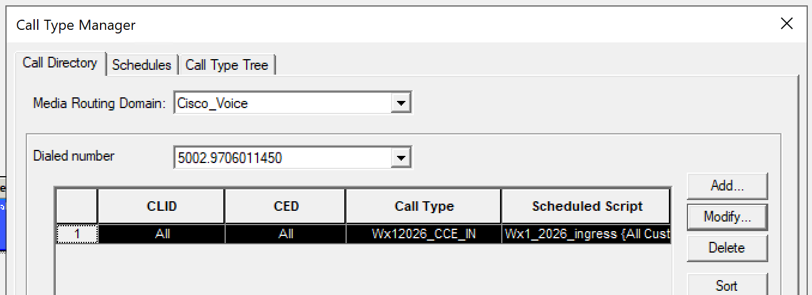

* Open up “Wx1\_BasicFlow1” script

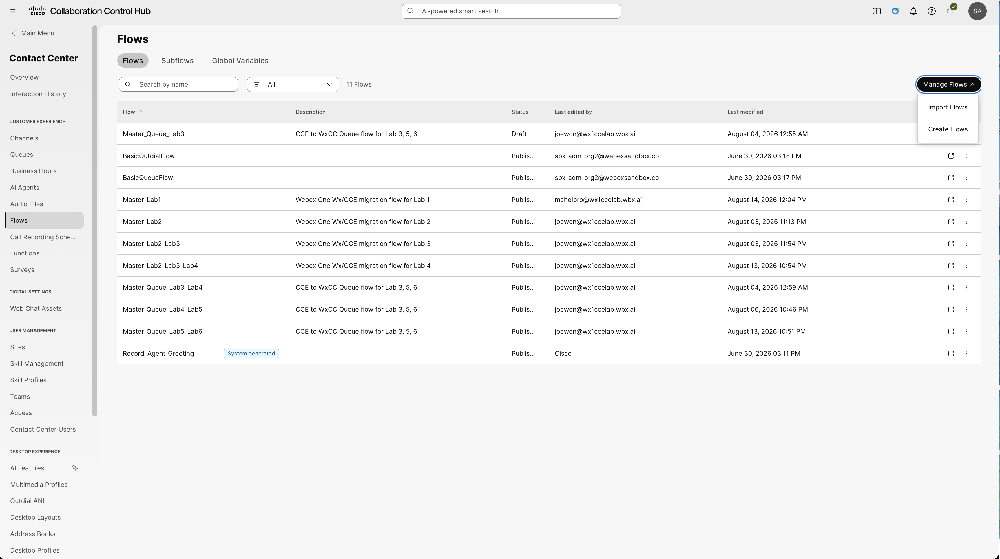

* On your student workstation open a new Firefox/Chrome browser
* Log into Collaboration Control Hub (<HTTPS://admin.webex.com>)
  + Enter your username **(**[**STUxx.admin@wx1ccelab.wbx.ai**](mailto:STUxx.admin@wx1ccelab.wbx.ai)**)** where “xx” is your student number
  + Enter your password **(Migration101!)**

  + Accept the Terms of Service

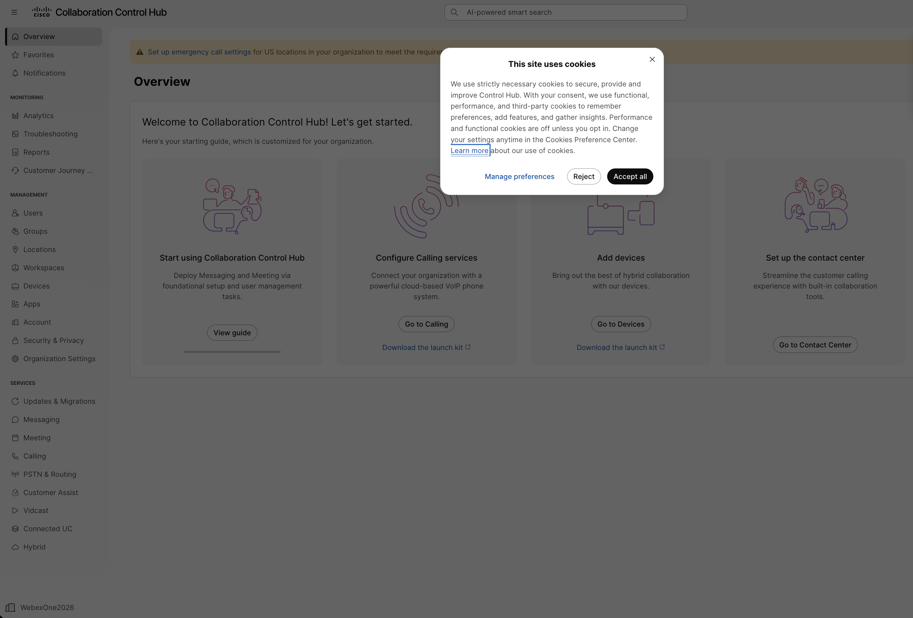

  + Click Accept All
* Click on the Contact Center under the Services section

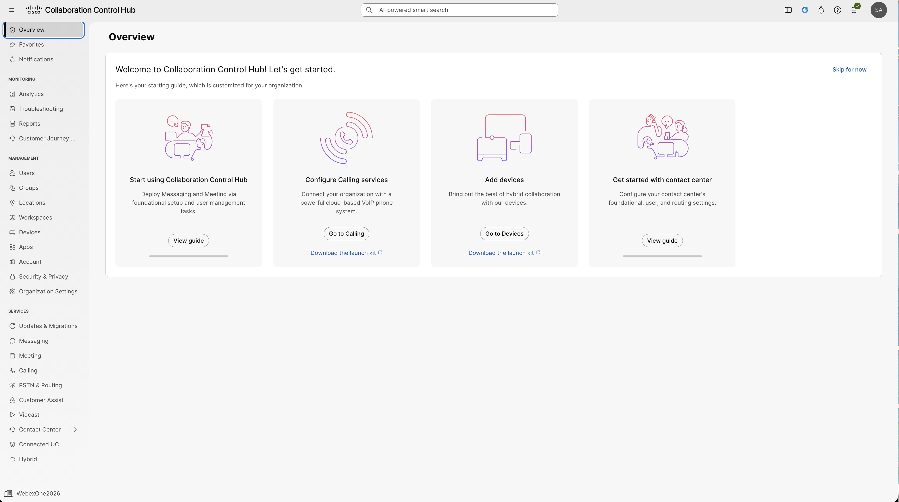

* Build Inbound Call Flow
  + From the Left Menu --> Under the Customer Experience Section --> “Click on Flows”

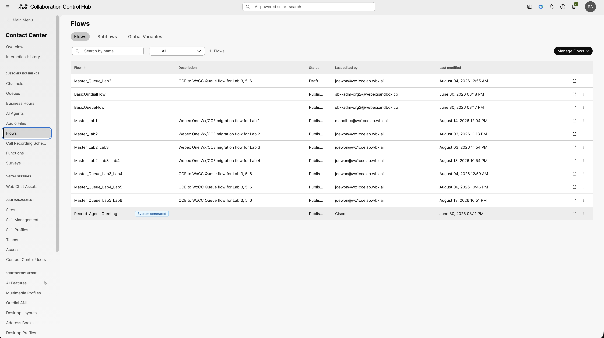

* + Create a new flow from template 🡪 Manage Flows 🡪 Create Flows

* + Within Webex Flow Designer 🡪Select “Use a template”
  + Click Next

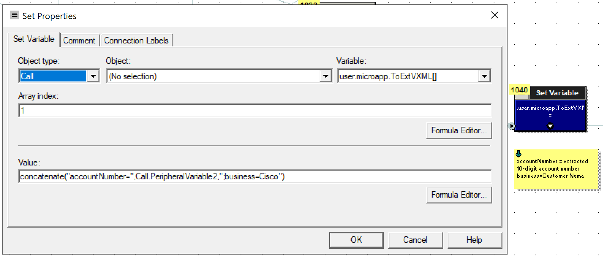

* + Select “Hello World” and click “Next”

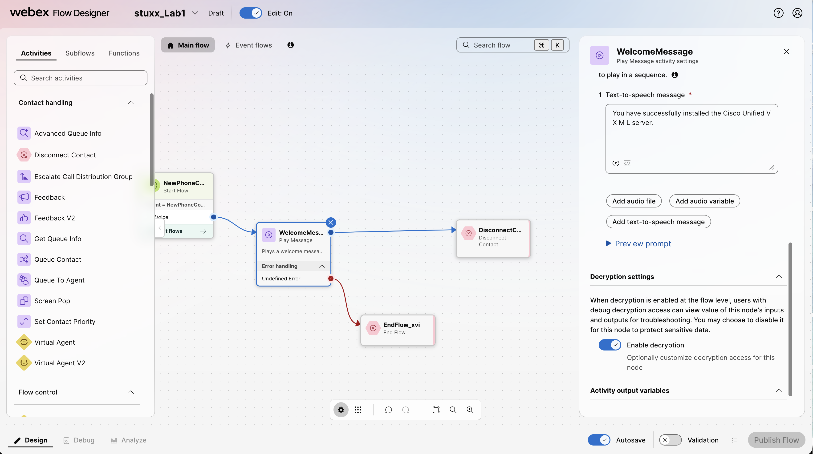

**Note:** If you click on “Preview”; the Flow Design opens a pop up with the following details:

* + - A Visual Representation of the Main Flow and all Event Flows
    - Description of the flow
    - Flow Details
    - Any Pre-requisites
    - Flow Breakdown
    - Activities Used
  + Rename the flow
    - Update the flow name from “HelloWorld\_Template” to “stuxx\_ Lab1”
    - Click Create Flow

* + Under the “General Settings” Section of the Global flow properties 🡪 update the Flow description to “My 1st Webex Contact Center Flow”

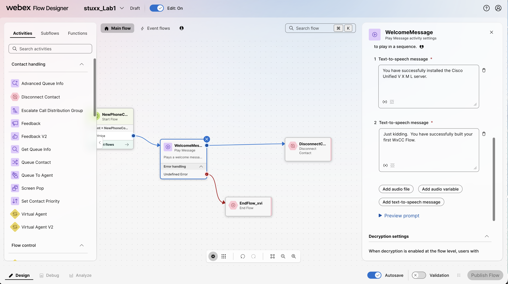

* + Under the “Decryption Settings” Section of the Global flow properties 🡪 Click “enable decryption”,

* + Review the “Debug details data disclosure”
  + Click “I agree” and “Save”

* + Show line grid slider.
    - View global flow properties
    - Auto arrange.
    - Undo
    - Redo
    - Fit to View
    - Zoom Out
    - Zoom In

* + - Before you ask…WxCC currently does not have line connectors or comment boxes. You can add Notes in the “Activity description” for any given Node.
  + Modify the Welcome Message Text-To-Speech (TTS)
    - Click on the “WelcomeMessage” Play Message Activity Box
    - Update the existing message with “You have successfully installed the Cisco Unified V X M L server.”

* + Add an additional TTS message
    - Click on “Add text-to-speech message”
    - Add message “Just kidding. You have successfully built your first WxCC Flow.”

* + Preview the audio prompts:
    - Click on “Preview prompt”

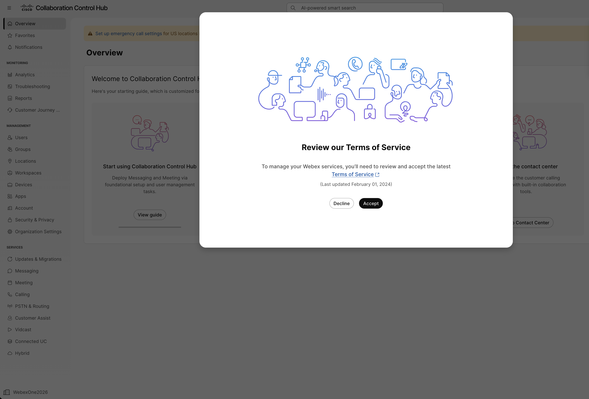

* + - In the Choose a voice to test the prompt dialog box select “en-US-Maria” or “en-US-Daniel”. There are several other voice options. Feel free to listen to them in other languages as time permits.

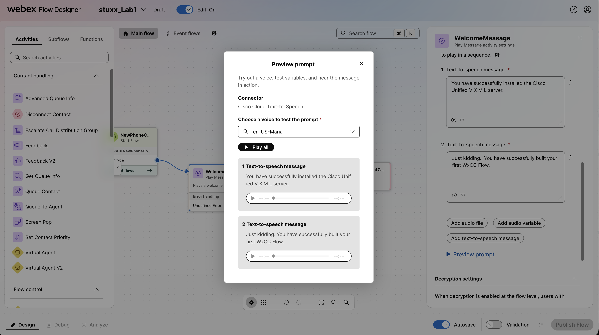

* + Validate your flow
    - Click on Validation in the lower right-hand corner of the Flow Designer

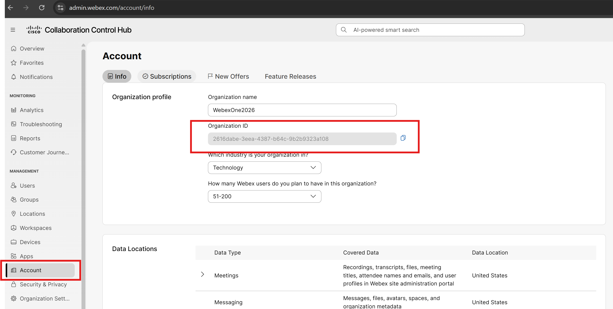

* + Publish the Flow. Use “latest” version label
    - Click “Publish Flow”

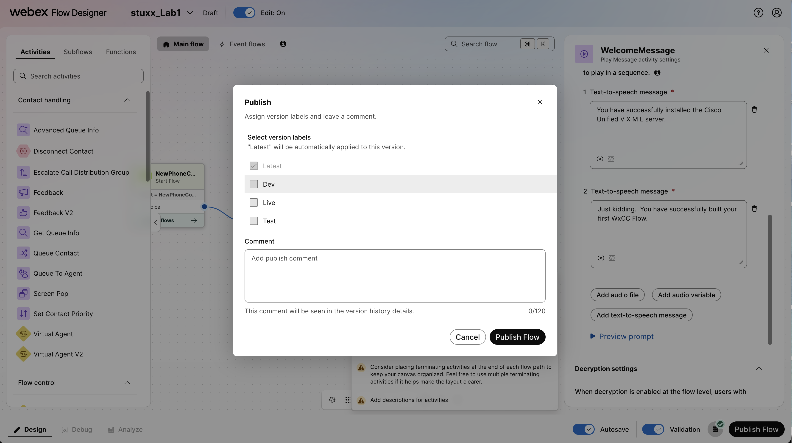

* Build Entry Point
  + Navigate back to Control Hub Contact Center
  + From the Left Menu --> Under the Customer Experience Section --> Click on “Channels”

* + Click on “Create a channel”

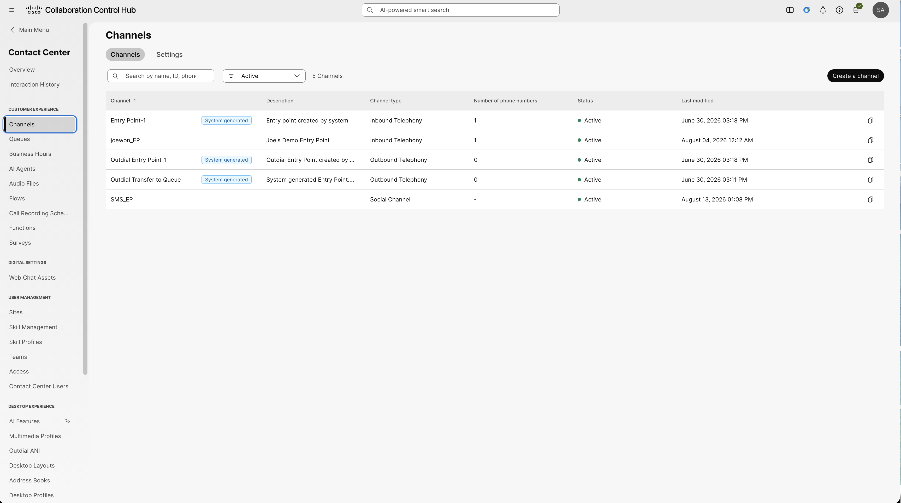

* + - Name: stuxx\_Lab1\_EP
    - Channel Type: Inbound Telephony
    - Service level threshold: 120
    - Timezone: America/Chicago
    - Routing flow: stuxx\_Lab1
    - Music on hold: SandboxUpload1.wav
    - Version label: Latest
    - Phone numbers: Click “add”
      * Webex Calling Location: Site1
      * PSTN number: Select an available phone number from the drop-down list
      * Actions: click the 
    - Click “Create”

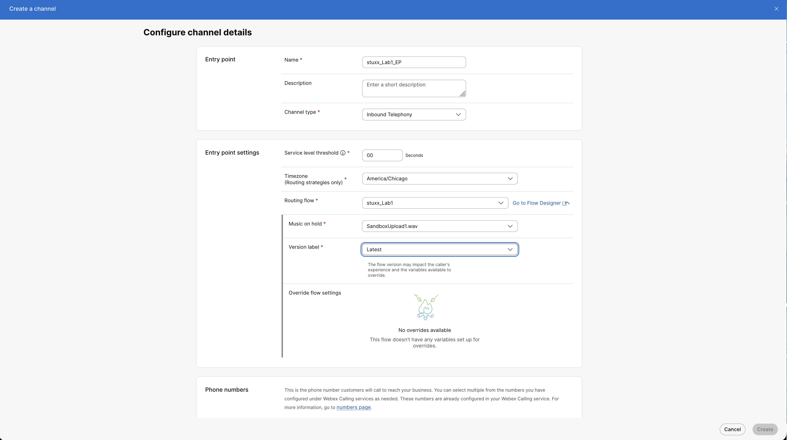  

* Call the number. Hear the greeting
