# CCE Base and Lab Overview (Lab 0)

## Objective:

* Get students familiar with the CCE and WxCC lab environments.
* Ensure they all have access to configure WxCC flows and test.

## Prerequisites:

* Understanding of CCE terminology and CCE flow building

## Lab Contents:

* 0A – CCE Flows
* 0B – WxCC Environment and Logins

## Instructor Show and Tell: 0A - CCE Flows

* Students watch the instructors in this section. There are no steps for students to take on their own.
* Instructor VPNs into the environment
* Ingress Flow Structure
  + Dialed Number to CallType to Script

  + CVP Media Setup

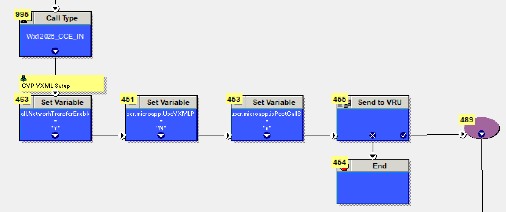

  + Microapp Configuration

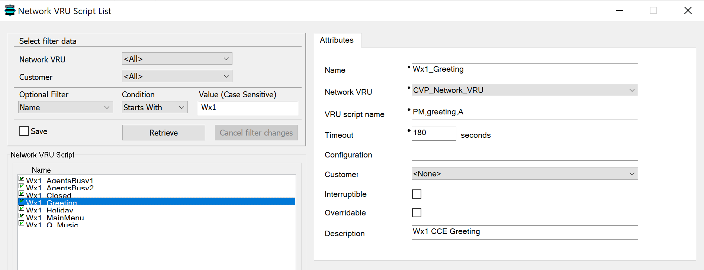

  + Audio directory configuration
  + Greeting

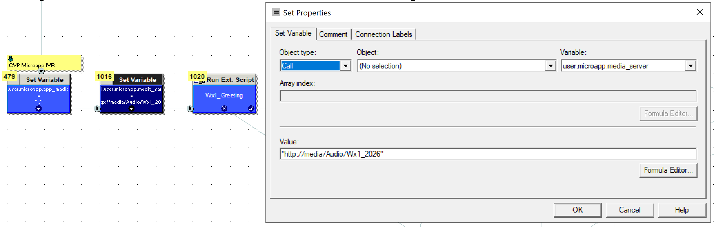

  + Switches and Percent Allocates

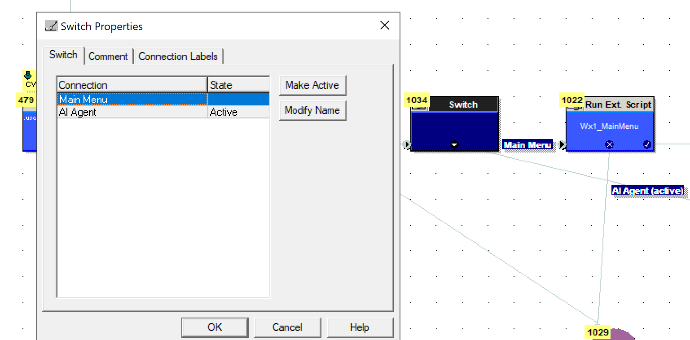

  + DTMF Menu

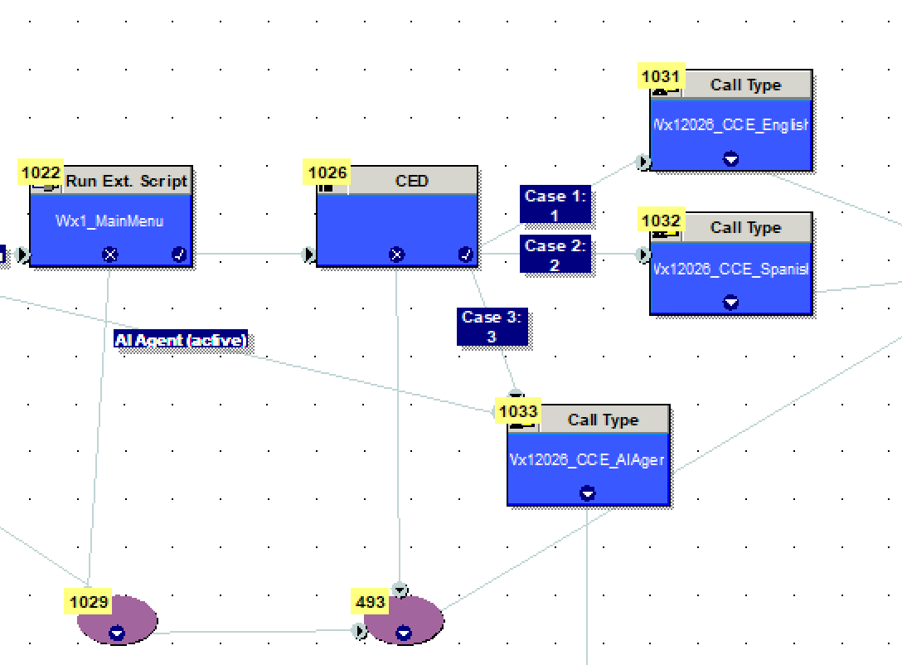

  + CVP Studio App/AI Agent

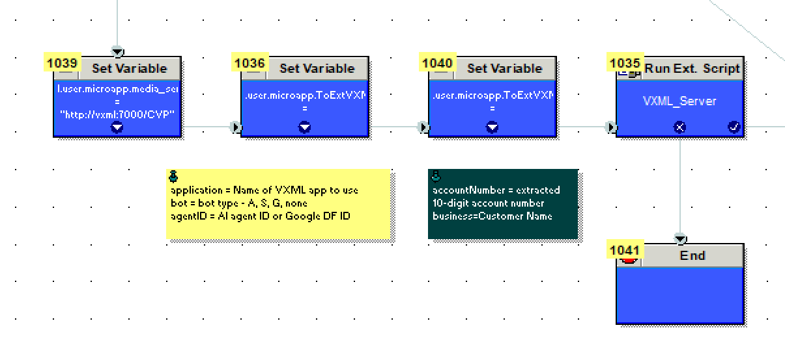

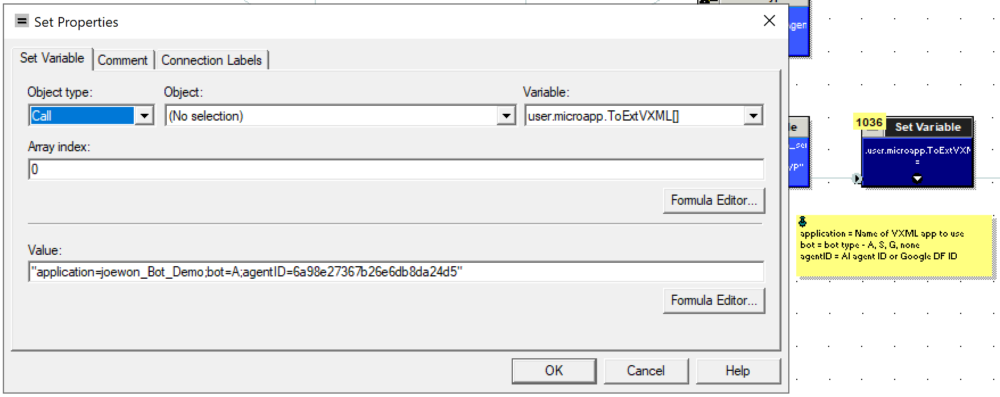

  + Tracking Options
  + Go To Script

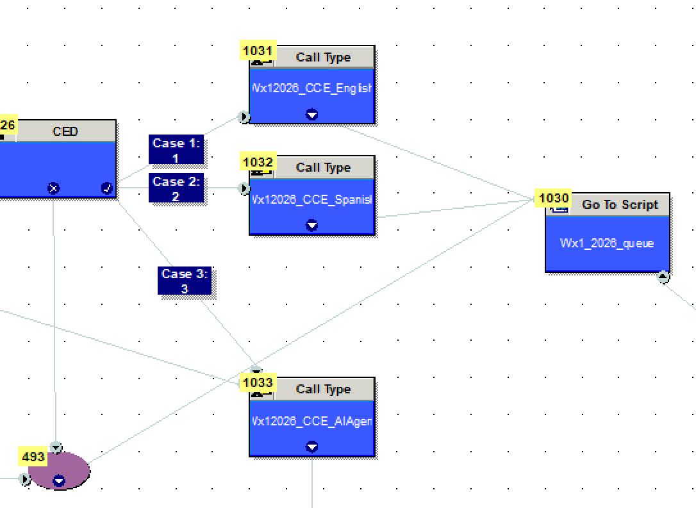

* Queue Flow Structure
  + CVP Media Setup (again)

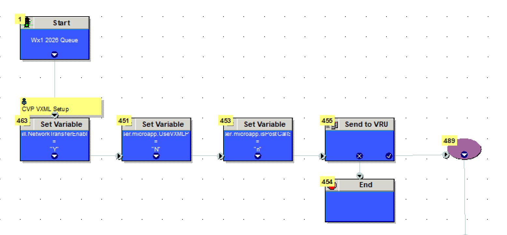

  + Audio directory configuration (again)
  + Business Hours

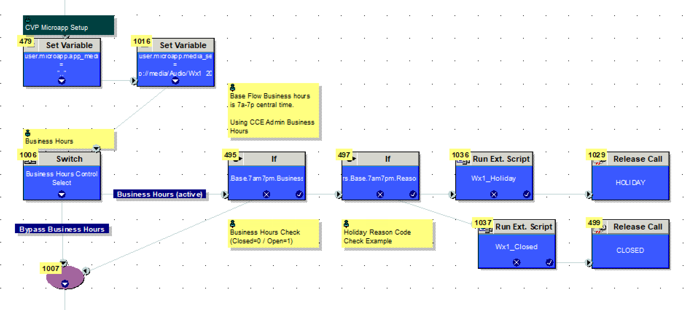

  + “If” routing logic

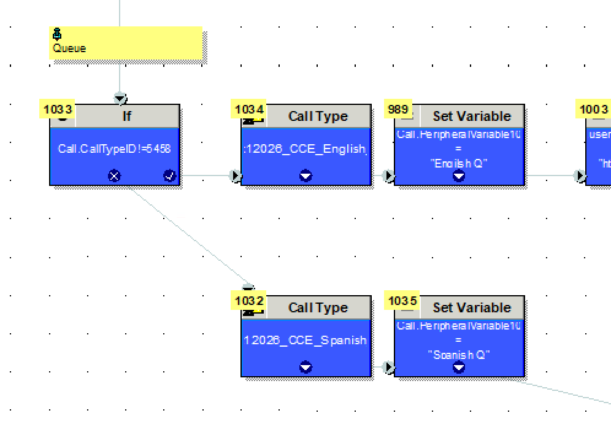

  + Audio directory configuration (again)
  + Agent Whisper

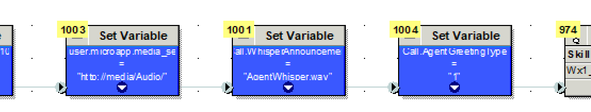

  + Queues
  + Audio directory configuration (again)
  + Queue Loop

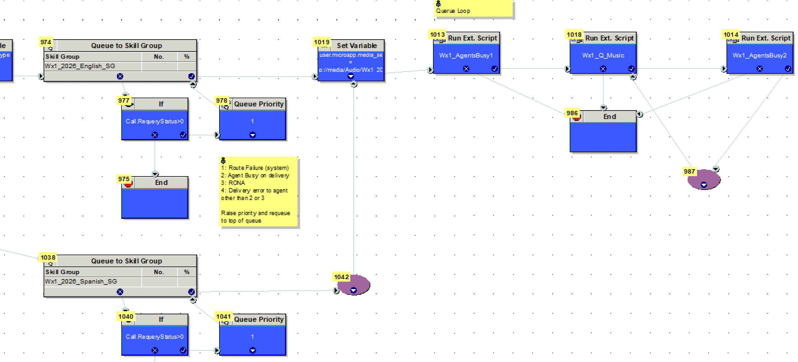

* Flow Functionality
  + Monitor ingress flow

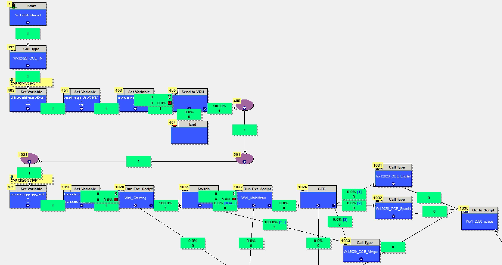

  + Call it

## Student Walkthrough: Lab 0B- WxCC Environment and Logins

* (NO VPN)
* Now it’s your turn! On your student workstation open a new Firefox/Chrome browser.
* Log into Collaboration Control Hub (<HTTPS://admin.webex.com>)
  + Enter your username **(**[**STUxx.admin@wx1ccelab.wbx.ai**](mailto:STUxx.admin@wx1ccelab.wbx.ai)**)** where “xx” is your student number
  + Enter your password: **Migration101!**

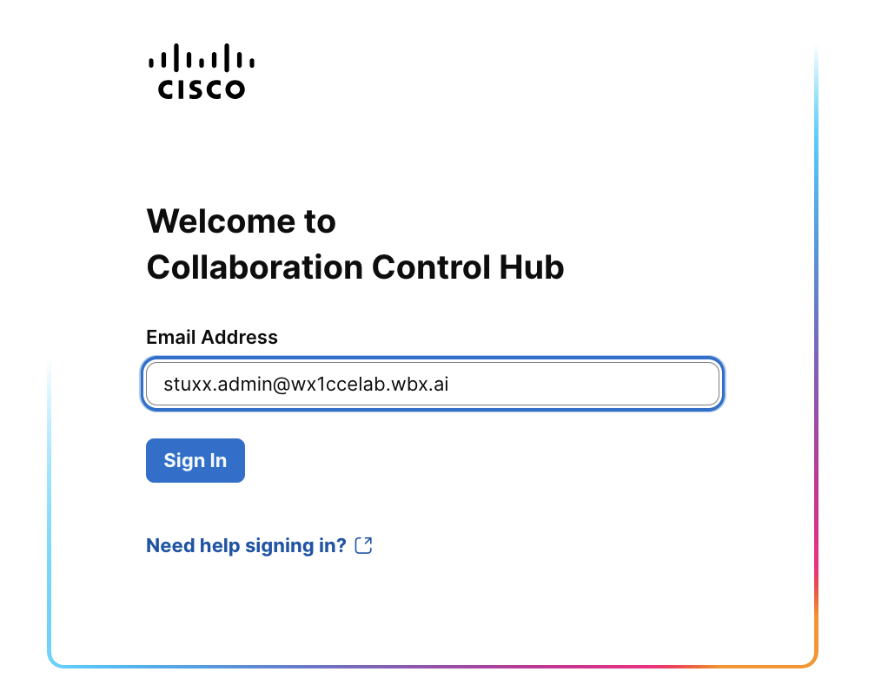

* Accept the Terms of Service

* Click Accept All
* Entitlement and Licensing
* Within Collaboration Control Hub à Management
  + Click Account
  + This is where your Organization ID is found. You will typically be asked for this when enabling feature flags or troubleshooting issues with TAC.

* Enable Agent and Supervisor
  + Within Collaboration Control Hub à Management
    - Click on Users
    - Filter by your student number “STUxx”

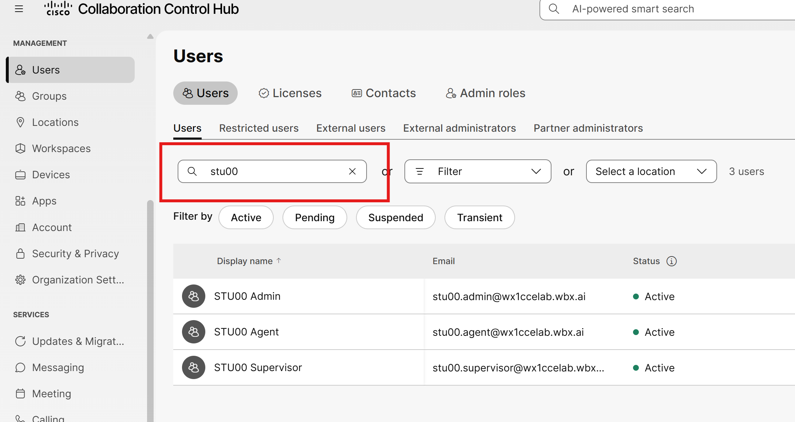

  + - Click on your Agent and/or Supervisor
    - Within Summary tab, scroll down to “Licenses”. Agent and Supervisor licenses shown below
    - Click “Edit Licenses.” (Instructor will show how to assign net new contact center licensing)

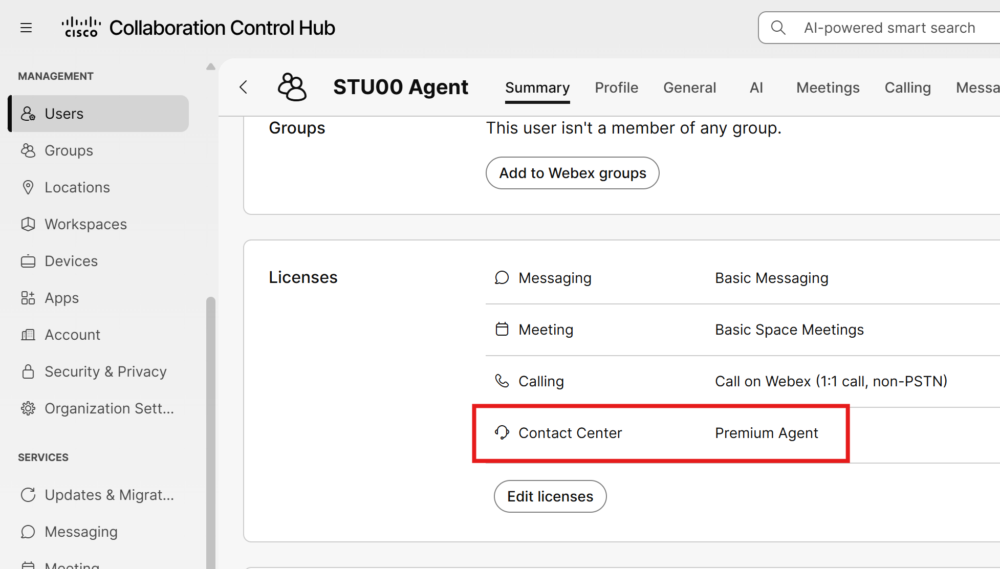

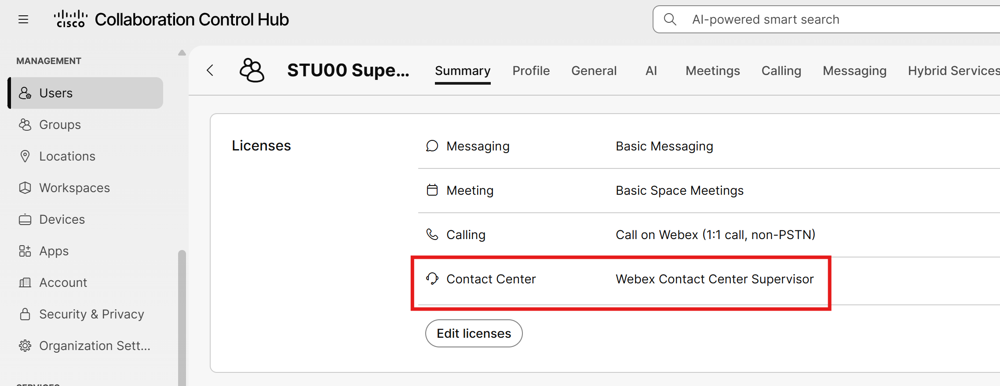

* Within Collaboration Control Hub à Services
* Click on “Contact Center”

## Finish Lab 0
