# Lab 1 – Basic Ingress

## Objective:

1. Build a simple script in Webex Contact Center (WxCC) using the existing Contact Center Enterprise (CCE) flow as a template.
2. Understand how a call starts within a WxCC Flow and similarities to CCE dialed numbers, call types, and scripts.
3. Configure and test native Webex Text-to-Speech

## Prerequisites:

* Lab 0 familiarity with both CCE and WxCC environment and logins.

## Instructions: Lab 1

* You should still be logged in as [STUxx.admin@wx1ccelab.wbx.ai](mailto:STUxx.admin@wx1ccelab.wbx.ai) from Lab 0. If not:
  + On your student workstation open a new Firefox/Chrome browser and log into Collaboration Control Hub (<HTTPS://admin.webex.com>)
  + Enter your username **(**[**STUxx.admin@wx1ccelab.wbx.ai**](mailto:STUxx.admin@wx1ccelab.wbx.ai)**)** where “xx” is your student number
  + Enter your password: **Migration101!**
* Build Inbound Call Flow
  + From the Left Menu --> Under the Customer Experience Section --> “Click on Flows”

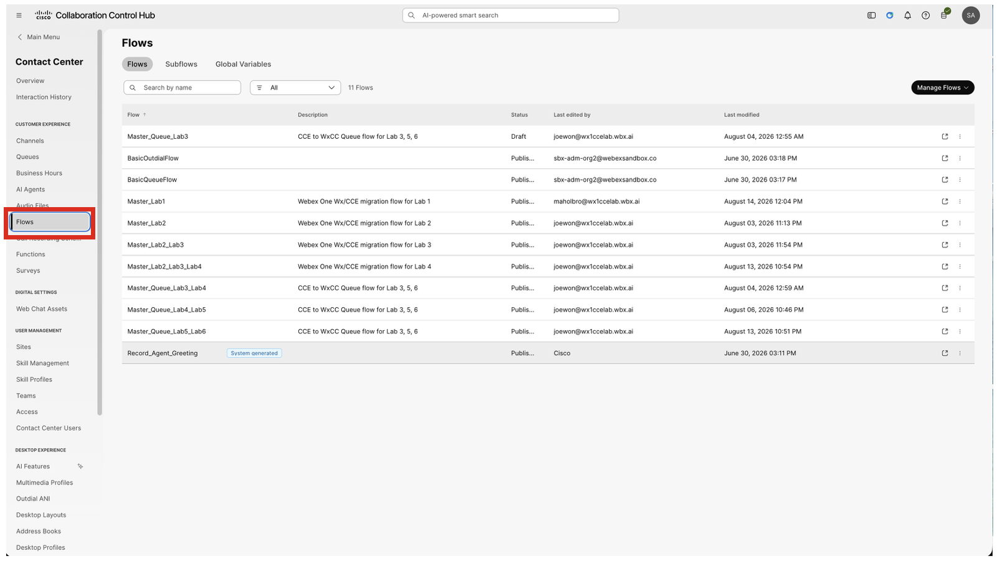

  + Create a new flow from template a Manage Flows a Create Flows

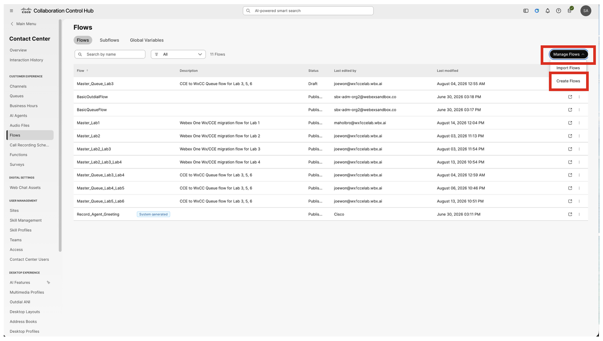

  + Within Webex Flow Designer a Select “Use a template”
  + Click Next

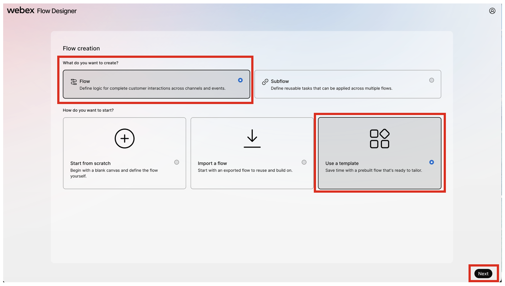

  + Select “Hello World” and click “Next”

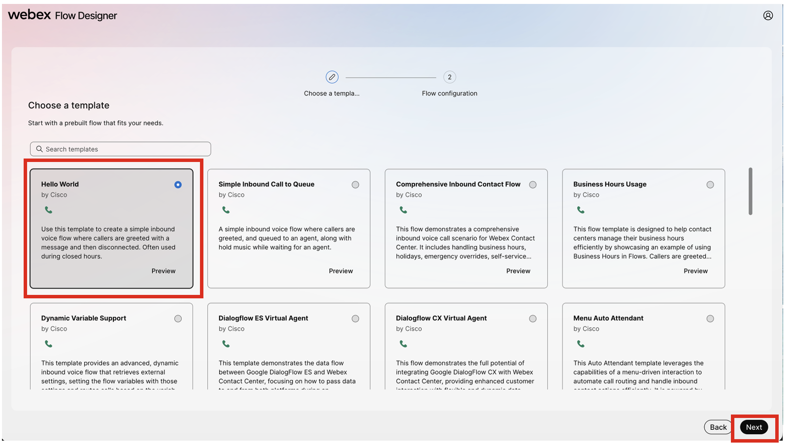

**Note:** If you click on “Preview”; the Flow Design opens a pop up with the following details:

  + A Visual Representation of the Main Flow and all Event Flows
    - Description of the flow
    - Flow Details
    - Any Pre-requisites
    - Flow Breakdown
    - Activities Used
  + Rename the flow
    - Update the flow name from “HelloWorld\_Template” to “STUxx\_ Lab1”
    - Click Create Flow

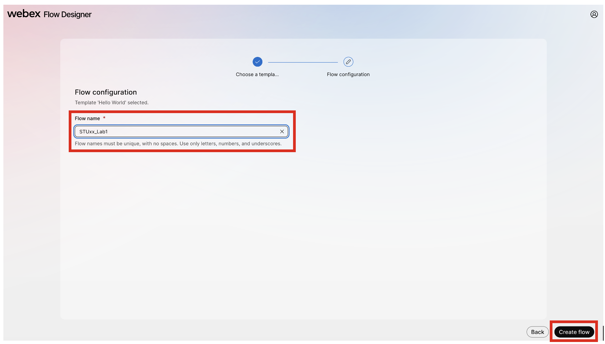

  + Under the “General Settings” Section of the Global flow properties a update the Flow description to “My 1st Webex Contact Center Flow”

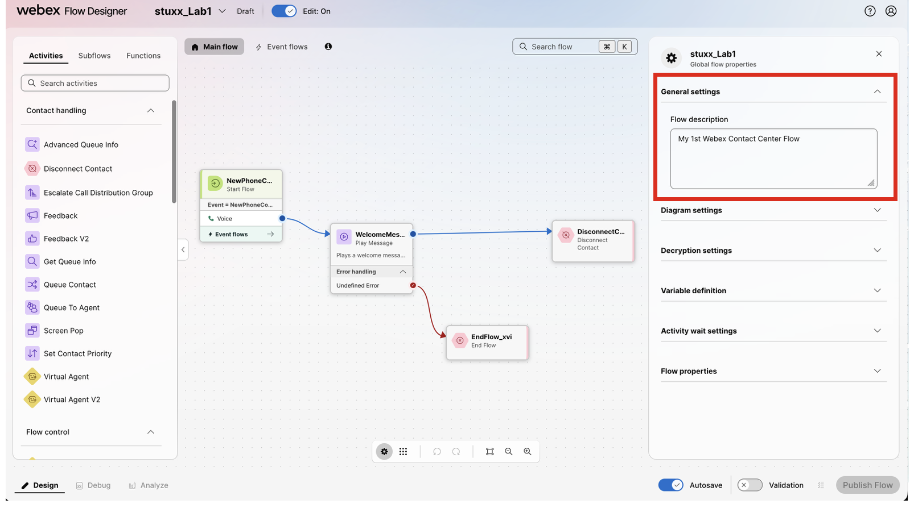

  + Under the “Decryption Settings” Section of the Global flow properties a Click “enable decryption”,

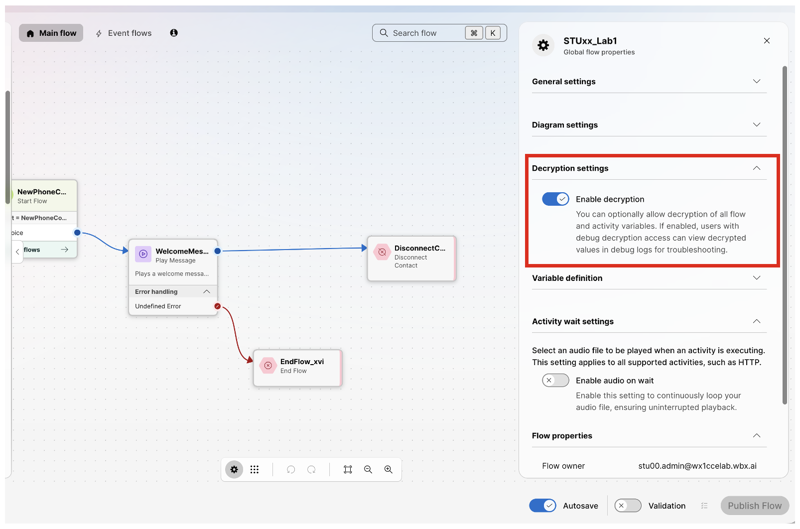

  + Review the “Debug details data disclosure”
  + Click “I agree” and “Save”

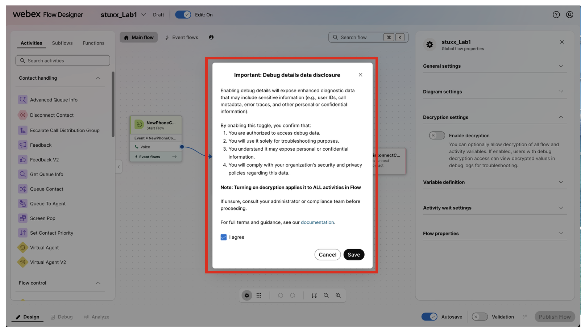

  + Show line grid slider.
    - View global flow properties
    - Auto arrange.
    - Undo
    - Redo
    - Fit to View
    - Zoom Out
    - Zoom In

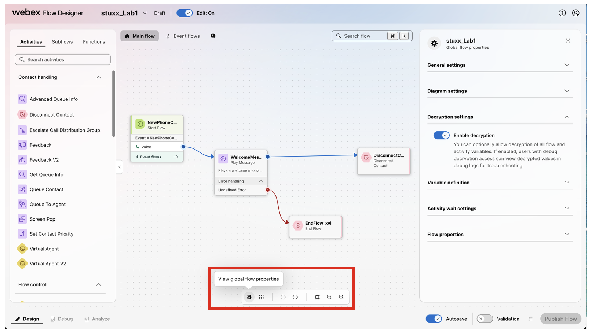

  Note: WxCC currently does not have line connectors or comment boxes. You can add Notes in the “Activity description” for any given Node.
  
  + Modify the Welcome Message Text-To-Speech (TTS)
    - Scroll down to the “Text-to-speech message” free-form text box
    - Replace the existing “Hello World” message with “You have successfully installed the Cisco Unified V X M L server.”

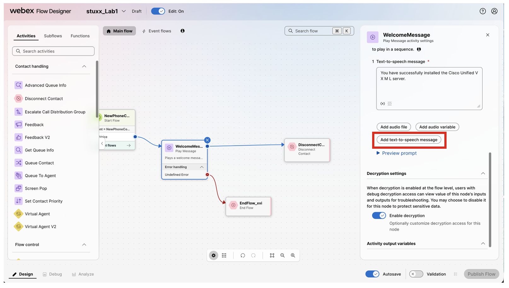

  + Add an additional TTS message
    - Click on “Add text-to-speech message”
    - Add message “Just kidding. You have successfully built your first WxCC Flow.”

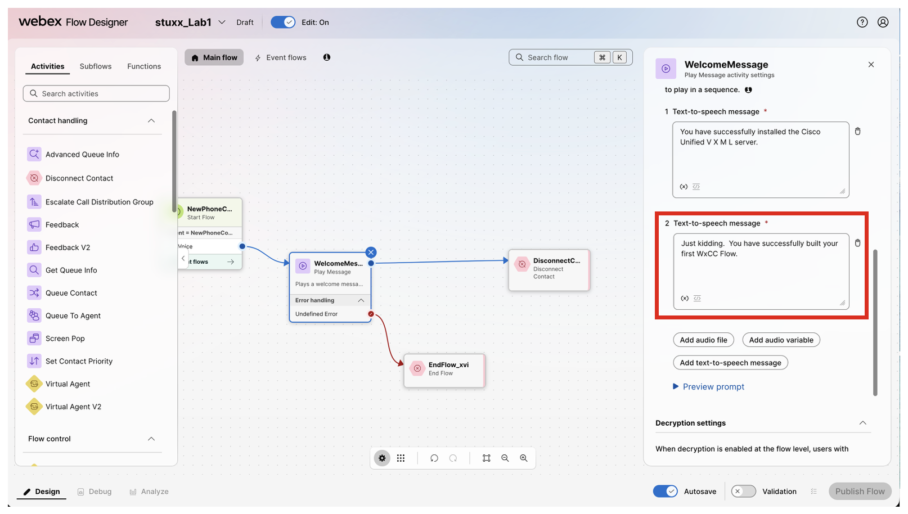

  + Preview the audio prompts:
    - Click on “Preview prompt”

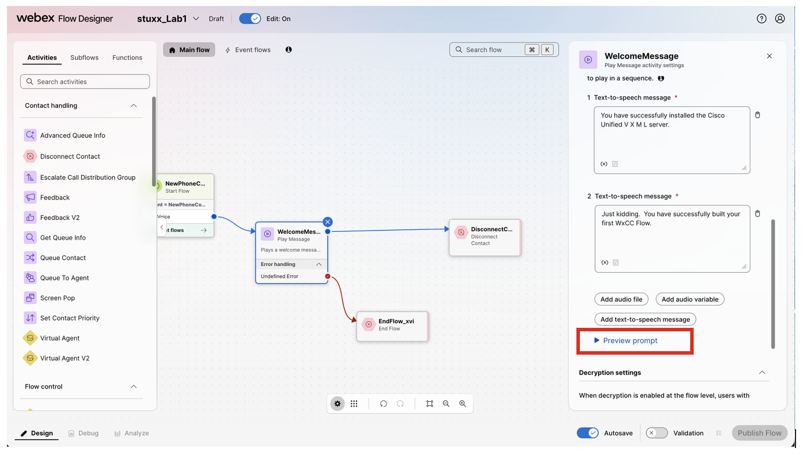

    - In the Choose a voice to test the prompt dialog box select “en-US-Maria” or “en-US-Daniel”. There are several other voice options. Feel free to listen to them in other languages as time permits.

  + Validate your flow
    - Click on Validation in the lower right-hand corner of the Flow Designer

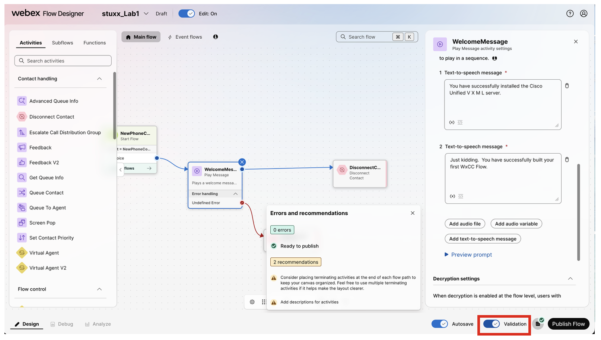

  + Publish the Flow. Use “Latest” version label
    - “Latest” version label is checked by default
    - Click “Publish Flow”

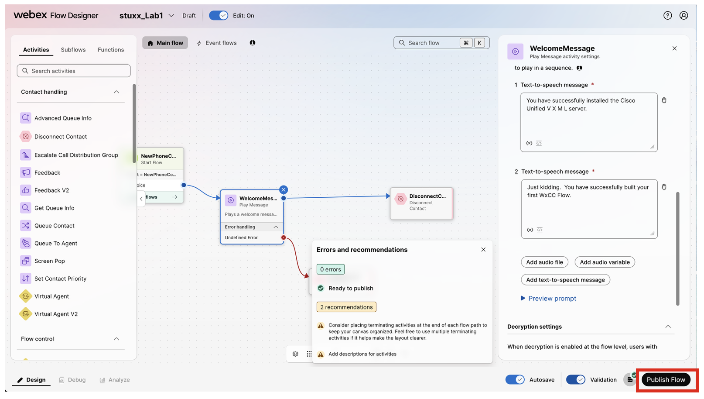

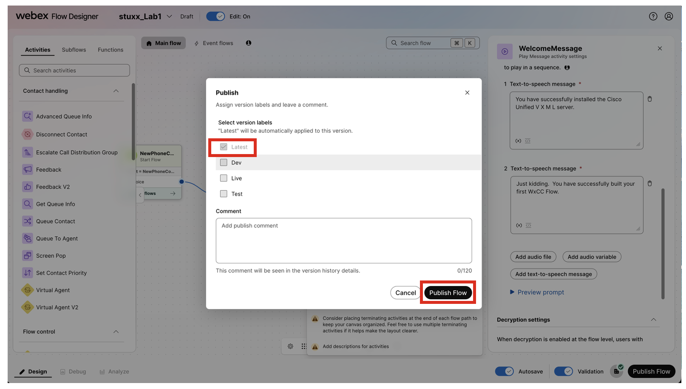

+ Build Entry Point
  - Navigate back to Control Hub Contact Center, which should still be opened in another browser tab
  - From the Left Menu --> Under the Customer Experience Section --> Click on “Channels” 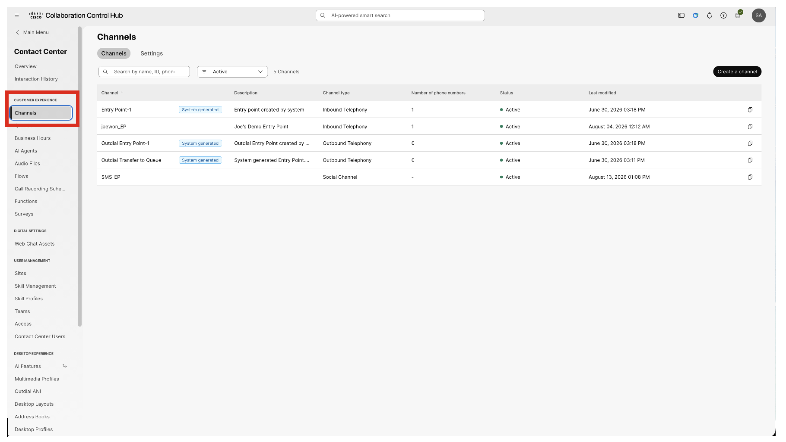
  - Click on “Create a channel”

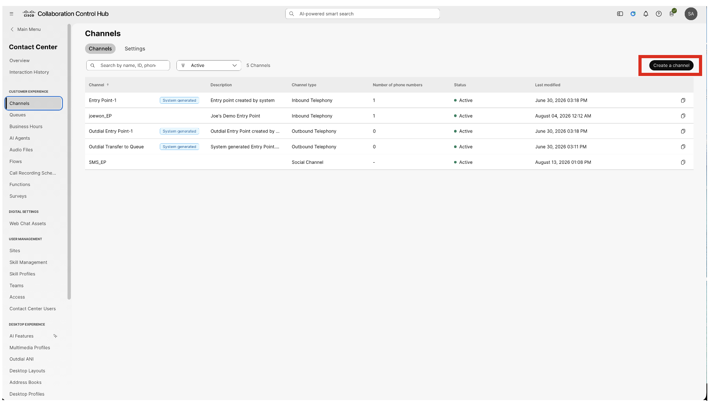

  + Update the configuration:
    - Name: STUxx\_Lab1\_EP
    - Channel Type: Inbound Telephony
    - Service level threshold: 120
    - Timezone: America/Chicago
    - Routing flow: STUxx\_Lab1
    - Music on hold: SandboxUpload1.wav
    - Version label: Latest
    - Phone numbers: Click “add”
      * Webex Calling Location: Site1
      * PSTN number: Select an available phone number from the drop-down list
      * Actions: click the 
    - Click “Create”

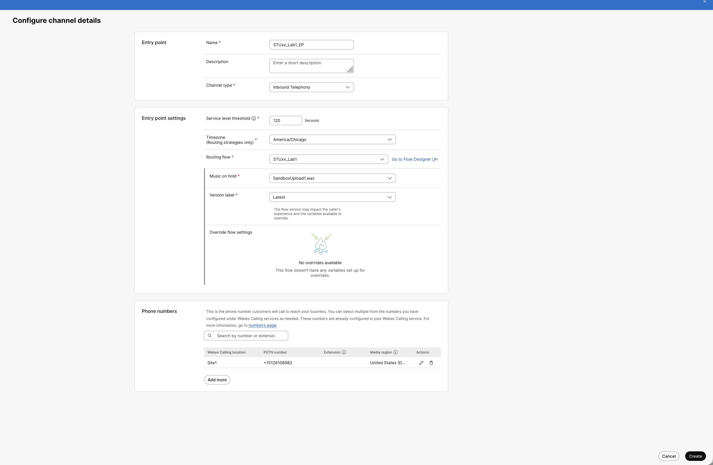

* Call the number you selected. Hear the greeting

## Finish Lab 1
