# Lab 4 – Speech IVA

## Objectives:

* Add a speech IVA using Webex AI Agent to a flow.
  + Import and modify and existing Webex AI Agent
  + Experience a simple generative AI autonomous agent
* Configure a flow diversion node to redirect calls between different paths.
* Update flow variables and global variables for new options.
* Learn how to pass context data in and retrieve context data out of an AI Agent

## Prerequisites

* Lab 3
* Instructors turn on AI Features prior to this lab starting.
  + Generated Summaries and Real-time transcription

## Instructions: Lab 4

* Within Collaboration Control Hub à Contact Center 🡪 Overview page
* On the right side under Quick Links, click on Webex AI Agent

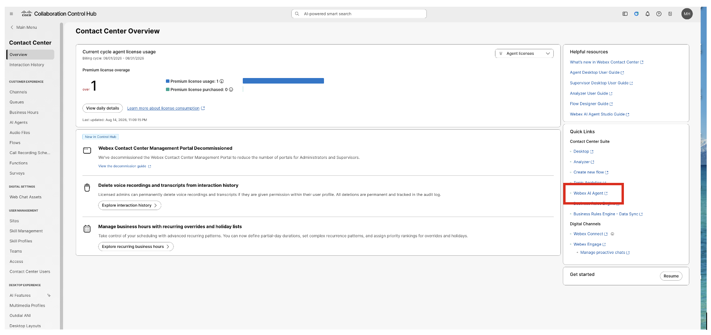

* Click on “Import agent”
* Import the “Wx1\_HelloWorld” AI agent json file provided
  + Click on Import Agent
  + Click on the Upload button and select the “Wx1\_HelloWorld” AI Agent json file provided
  + Agent Name: STUxx\_HelloWorld
  + System ID: Leave to whatever system generated
  + Click Import

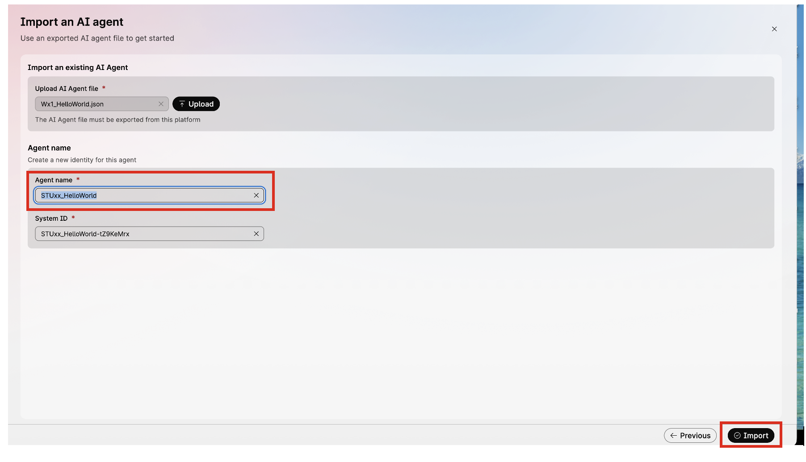

  + Review AI Agent “Profile”, “Instructions”, “Knowledge”, “Actions”, and “Conversation” Tabs
  + Click on the Knowledge Tab
    - Select “Wx1\_2026\_KB” from the drop-down box
    - Click “Save Changes”

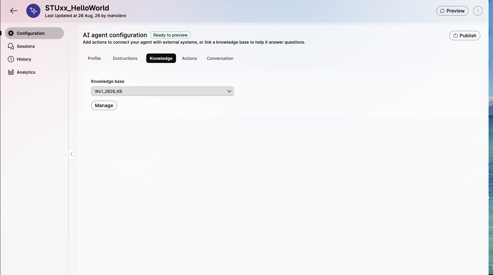

  + Click “Manage” then “Agree” and review the included types of knowledge base files. When finished, click the  to return to the AI Agent Knowledge tab.

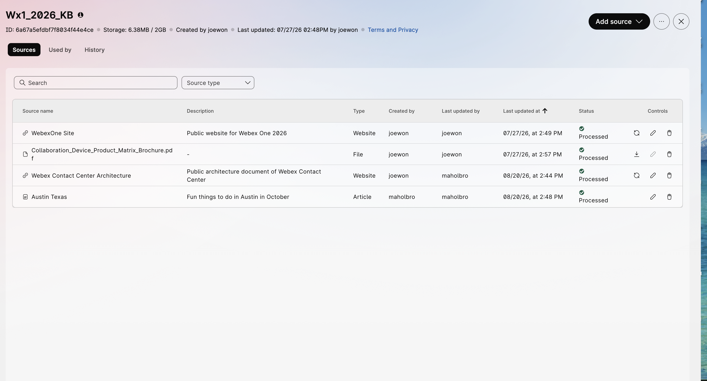

  + Click Publish
    - Comment: “First AI Agent”
  + Click Publish

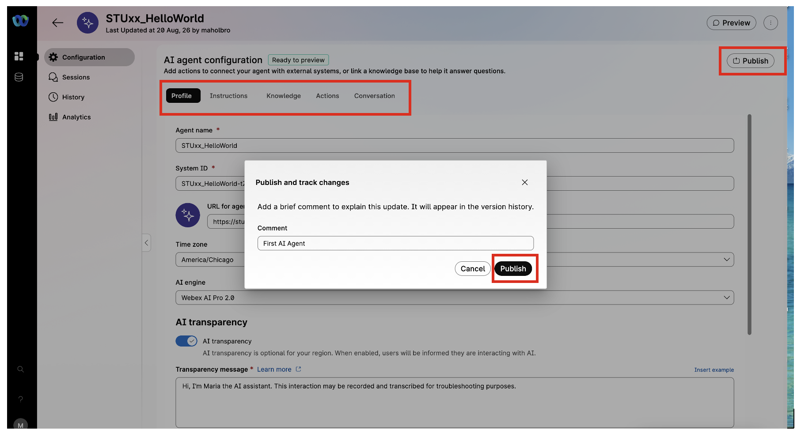

* Within Collaboration Control Hub à Contact Center
* Click on Flows from the navigation panel
* Create a copy of your “STUxx\_Lab2” flow
* Open the newly created copy “Copy\_STUxx\_Lab2\_......”
* Go into Edit Mode and rename the flow to “STUxx\_Lab4”, then click Save

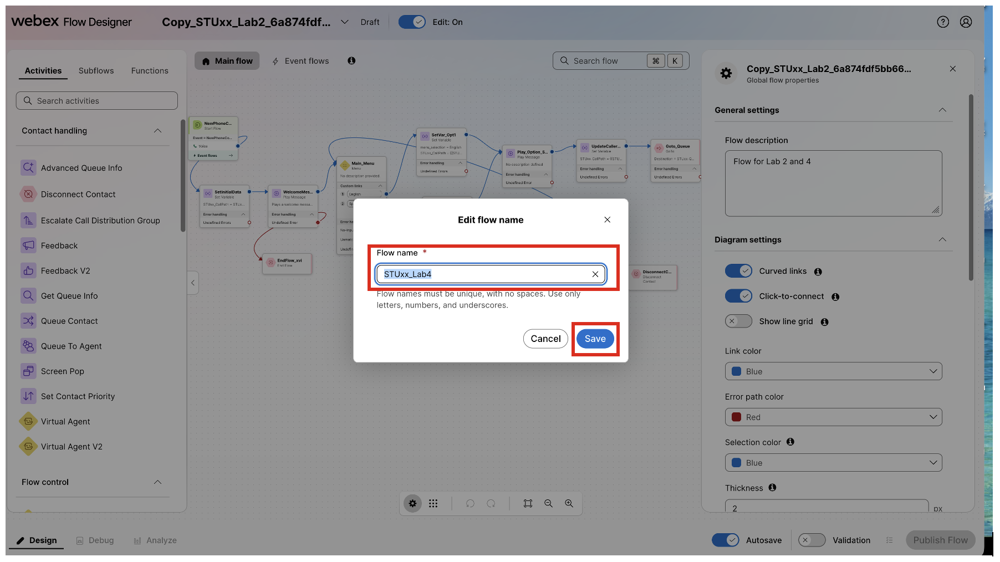

* Select the WelcomeMessage node and change the text-to-speech message to say “This is my flow for lab 4”
* Disconnect the “WelcomeMessage” node exit path from the Main\_Menu node

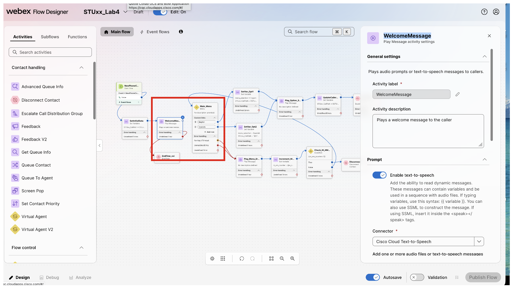

* Drag “Percent Allocation” node between the “WelcomeMessage” node and “Main\_Menu” node
* Connect the welcome message node to the new Percent Allocation node

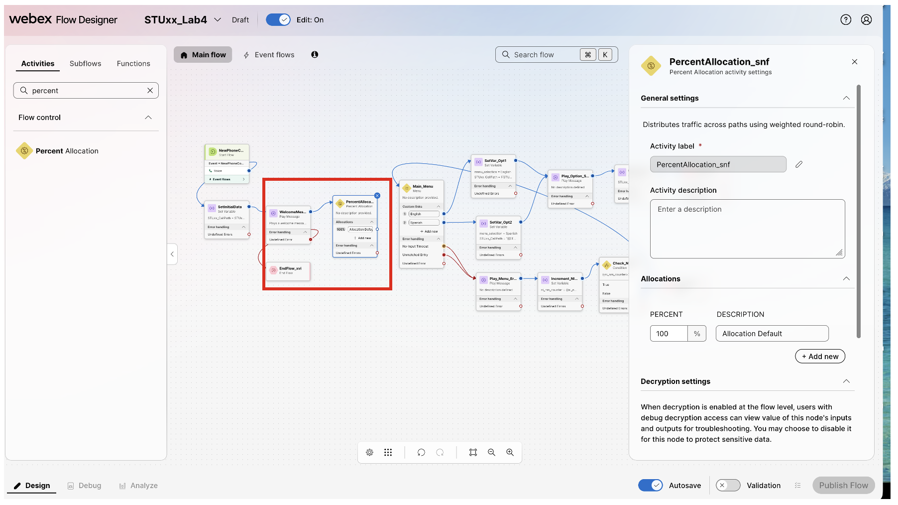

* Select the new Percent Allocation node and configure as follows:
  + Activity Label: “IVR\_Divert”
  + Activity description: Allocate calls between DTMF and AI agent IVR
  + Rename “Allocation Default” to “DTMF IVR”
  + Click “+ Add new” button
  + Rename “New Allocation” to “AI Agent”
  + Set Percent for IVR to 0 and AI Agent to 100
  + Select enable decryption

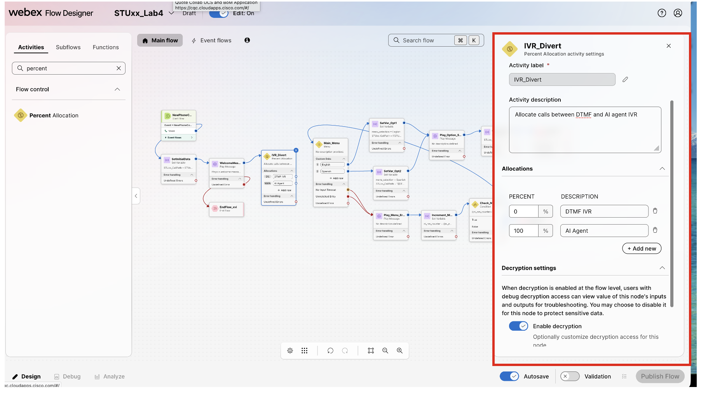

* Copy SetVar\_Opt2 node and paste it below the IVR\_Divert and Main\_Menu nodes
* Connect IVR\_Divert node’s “DTMF IVR” path to MainMenu node
* Connect IVR\_Divert node’s “AI agent” path to newly-created SetVar node.
* Select new SetVar Node
  + Activity Label: SetVar\_Opt3
    - Note: We will move this to the main menu later
  + Replace menu\_selection Set Value with : “A.I. Agent”
  + Replace STUxx\_CallPath Set Value with: `{{STUxx_CallPath}}.aiAgent`

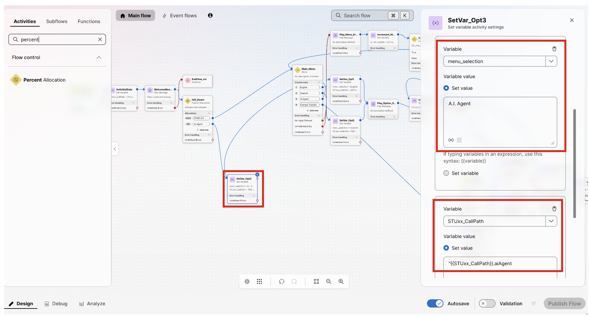

* Drag a new Virtual Agent V2 node to canvas
* Connect exit of SetVar\_Opt3 to new Virtual Agent V2 node
* Select Virtual Agent V2 node
  + Activity label: AI\_Agent
  + Select “Static Contact Center AI Config”
  + Contact Center AI Config : “Webex AI Agent (Autonomous)” from the Contact Center AI Config pulldown
  + Virtual agent: Select your recently created virtual agent “STUxx\_HelloWorld” from the Virtual agent pulldown
  + Expand “State Event”
  + Paste this into the Event data: `{'dnis': '{{NewPhoneContact.DNIS}}', 'callerANI':'{{NewPhoneContact.ANI}}'}`
  + Scroll to the bottom to Enable decryption

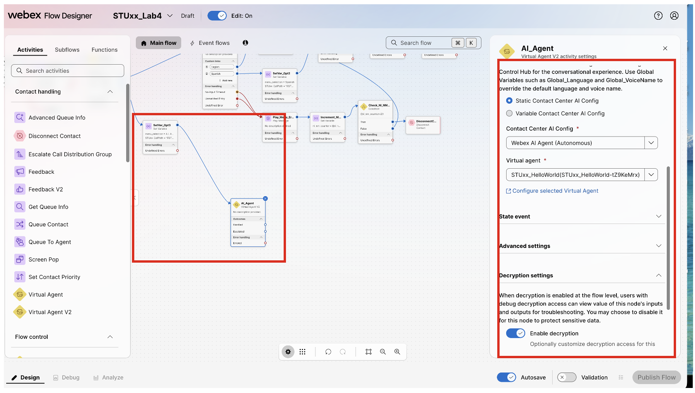

* Copy/paste the UpdateCallPath\_Queue node
  + Activity label: UpdateCallPath\_Contained
  + Replace set value to: `{{STUxx_CallPath}}.Contained`
* Connect the AI\_Agent node’s “Handled” path to UpdateCallPath\_Contained
* Connect UpdateCallPath\_Contained exit to DisconnectContact node

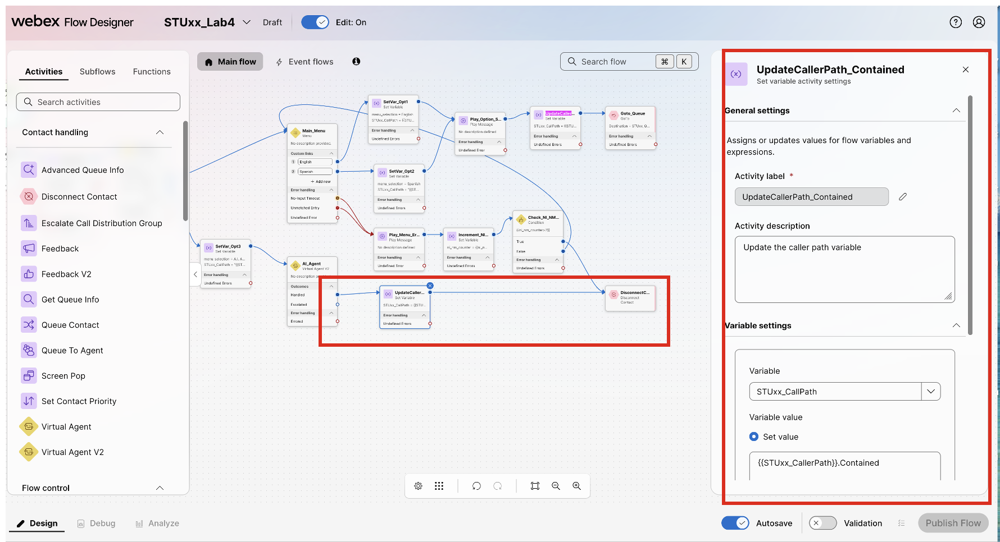

* Global Flow Properties 🡪 Configuration 🡪 Flow variables

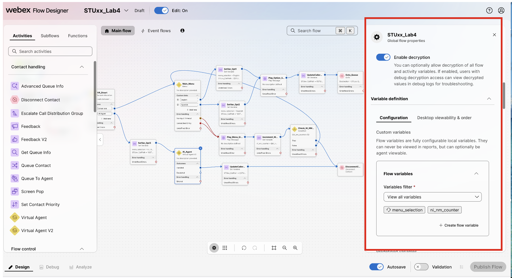

* Click ““+ Create flow variable”
  + Add context flow variables for AI agent escalation
  + Create 3 variables of Type: String that are agent viewable:
    - callerFirstName with agent viewable label First Name
    - callerLastName with agent viewable label Last Name and click “Agent editable”
    - callerLanguage with agent viewable label Language
  + Create 1 string variable that is not agent viewable:
    - aiAgentResponse

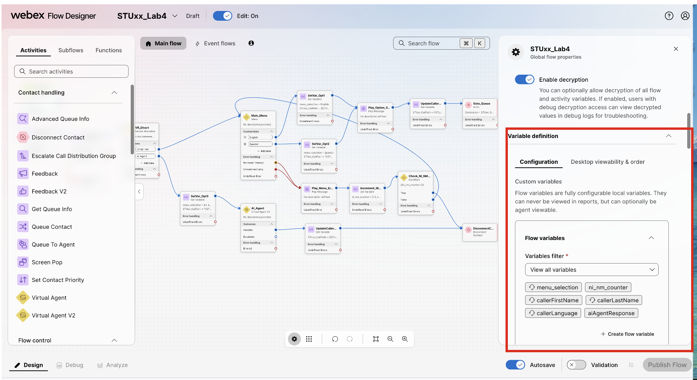

* Drag a Set Variable node to canvas below the “UpdateCallPath\_Contained” node
* Select the new Set Variable node
  + Activity label: SeeMetaData
  + Variable: aiAgentResponse
  + Variable value: `{{AI_Agent.MetaData}}`
* Connect “Escalated” path of the AI\_Agent Virtual Agent node to the SeeMetaData Set Variable node

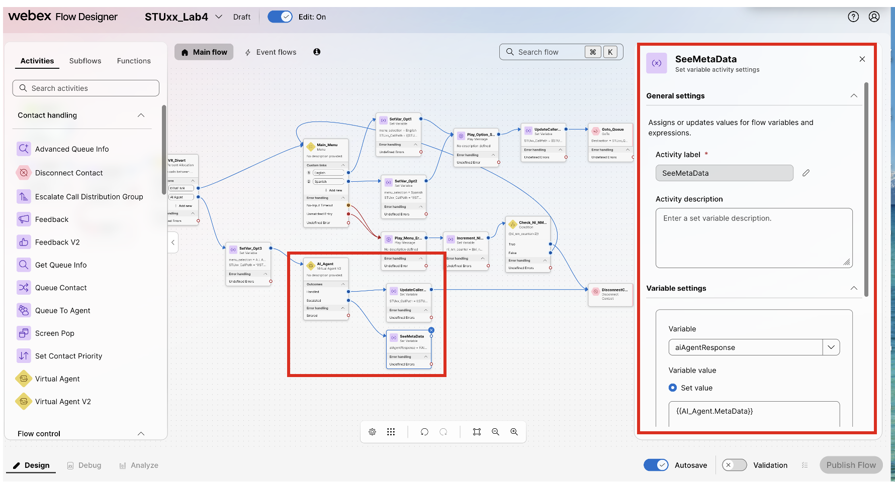

* Drag a Parse node to the canvas after the SeeMetaData node
* Select the new Parse node
  + Activity label: Extract\_AI\_Agent\_Data
  + Input variable: AI\_Agent.MetaData
  + Content type: JSON
  + Click on “+ Add Parsed variable”
  + Select “callerFirstName” variable for first Output variable
  + Path Expression: $.actions.transfer\_with\_context[0].input.firstName
  + Click on “+ Add new” button to add another variable to parse
  + Select “callerLastName” variable for first Output variable
  + Path Expression: $.actions.transfer\_with\_context[0].input.lastName
  + Click on “+ Add new” button to add another variable to parse
  + Select “callerlanguage” variable for first Output variable
  + Path Expression: $.actions.transfer\_with\_context[0].input.language
* Connect the SeeMetaData exit path to the new Extract\_AI\_Agent parse node
* Connect the new Extract\_AI\_Agent parse node to the UpdateCallPath\_Queue node (before GoTo\_Queue node)

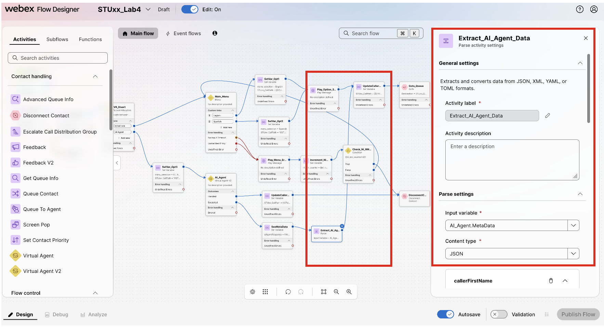

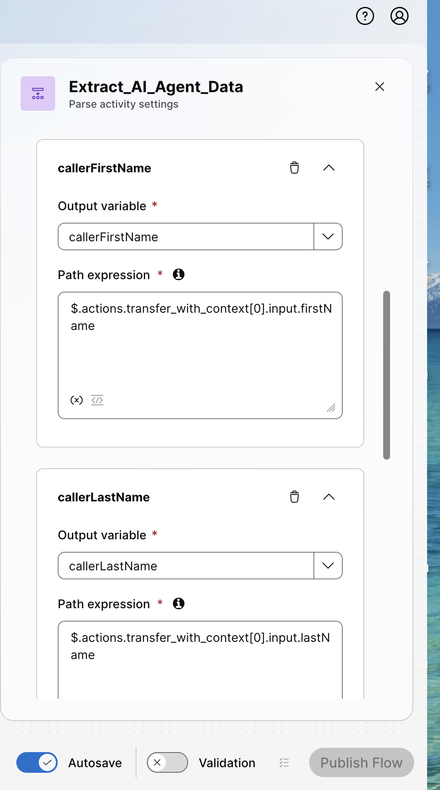

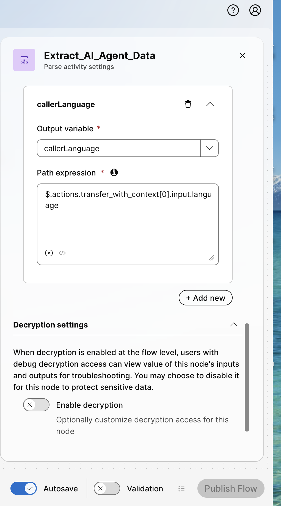

* Click on Validation
* Publish as Latest

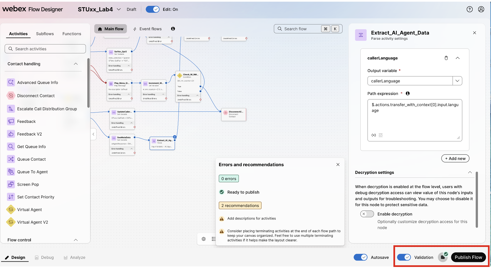

* Within Collaboration Control Hub à Contact Center
* Click on “Flows” from left navigation panel
* Open the “STUxx\_Queue\_Flow\_Lab3” queue flow from Lab3 and Edit
* Add flow variables for AI agent escalation
  + Create 3 string variables that are agent viewable:
    - callerFirstName with agent viewable label First Name
    - callerLastName with agent viewable label Last Name and click Agent editable
    - callerLanguage with agent viewable label Language
* Click on Validation
* Publish as Latest

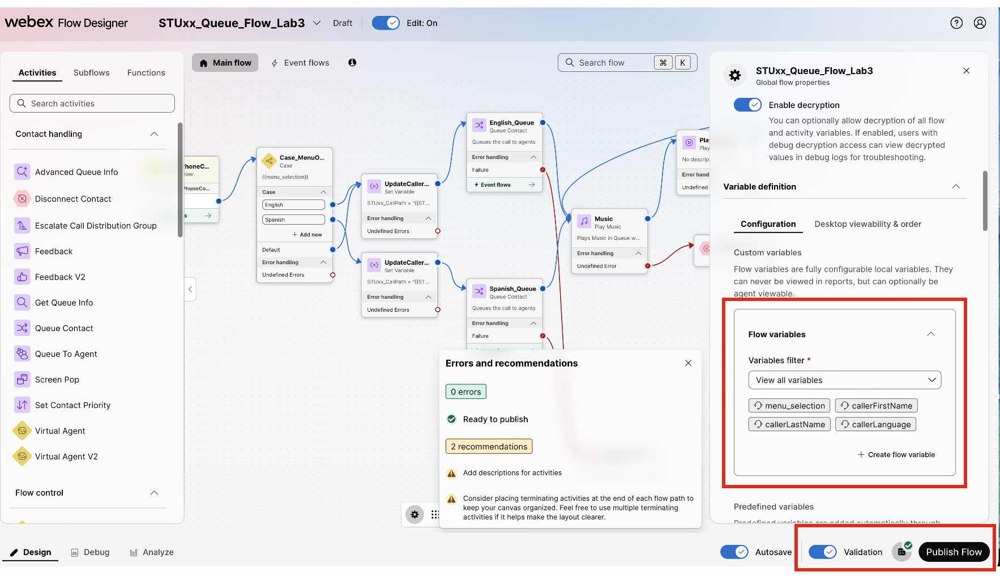

* Return to your “STUxx\_Lab4” AI agent flow
* Refresh the canvas flow (webpage refresh)
* Edit flow again
* Select Goto\_Queue node
* Flow variable mapping : Click “+ Add new” button
  + Select “callerFirstName” under “Map current variable” pulldown
    - Notice the destination is populated as the name are the same
  + Add 2 more for “callerLastName” and “callerLanguage”
* Click Validation
* If Validation fails but you are certain you have the mappings set correctly, refresh the browser and enable Validation again.
* Publish flow as latest

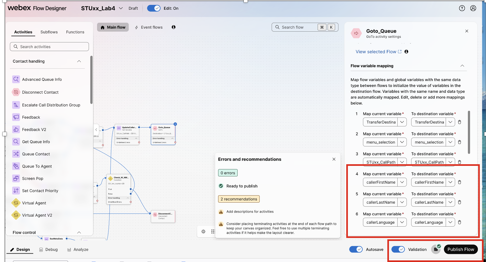

* In Control Hub 🡪 Channels rename your Entry point from STUxx\_Lab2\_EP to STUxx\_Lab4\_EP
* Change your “Routing Flow” dropdown from “STUxx\_Lab2” to “STUxx\_Lab4”
* Set the Music on Hold to defaultmusic\_on\_hold.wav
* Click Save
* Test
  + Use an incognito browser to log in to agent desktop and set yourself as Available
  + Call the flow. When Megan the AI Agent answers, allow it to add your caller record
  + Ask it any question around Webex one, Webex Contact Center Architecture, Fun things to do in Austin in October, or Collaboration Devices
  + Hang up, call the flow back
  + Observe the lookup successfully identify you this time
  + Say “habla Espanol?” to the AI agent.
  + The AI Agent will transfer the call to queue for Spanish support. But since your agent is only skilled for English proficiency, they will not receive the call.
  + End the call

## Finish Lab 4
