# Lab 5 – Enhancing the Queue

## Objectives:

* Learn how the following features are configured and operate relative to CCE equivalent:
  + Business Hours
  + Position in Queue (PIQ) and Estimated Wait Time (EWT)
  + Courtesy Call Back (CCB)
  + Whisper and Compliance Messages
* Configure and use native WxCC transcription services
* Experience different screen pop capabilities without custom gadgets.

## Prerequisites:

* Complete Lab 3

## Lab Contents:

* [5A – Business Hours](#_Walkthrough_Lab_5A)
* [5B – PIQ and EWT](#_Walkthrough_Lab_5B)
* [5C - Courtesy Call Back](#_Walkthrough_Lab_5C)
* [5D - Whisper and Compliance Message](#_Walkthrough_Lab_5D)
* [5E - Transcription/ScreenPop and Event flows](#_Walkthrough_Lab_5E)

## Instructions: Lab 5A – Business Hours

* Within Collaboration Control Hub à Contact Center 🡪 Customer Experience
* Click on “Business Hours” from navigation panel on left.
* Click on “Overrides”
  + Click on “Overrides”
  + Name: “STUxx\_Override”
  + Timezone: America/Chicago
  + Click “add a new override”
    - Name: STUxx\_Override
    - Duration: October 4 – October 9
    - All Day
    - Recurrence: Doesn’t repeat
    - Click “Add”
  + Click “Create”

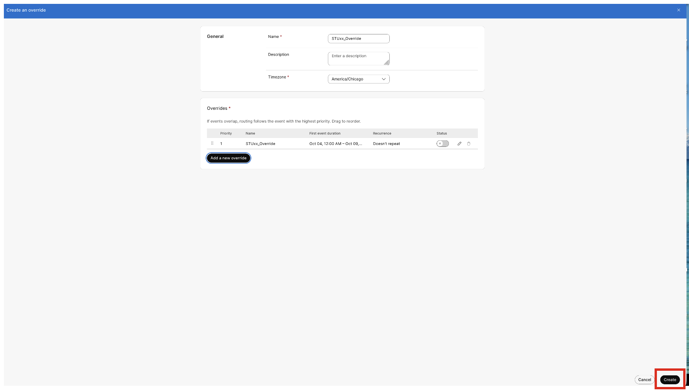

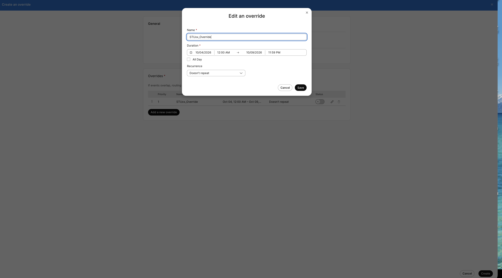

* Click on “Working Hours”
  + Click on “Create a working hour”
  + Name: STUxx\_Working\_Hours
  + Description: STUxx test business hours
  + Timezone: America/Chicago
  + Click Add Shift
    - Name: STUxx\_Day\_Shift
    - All days
    - Time duration: 8a-6p
    - Click “Save”

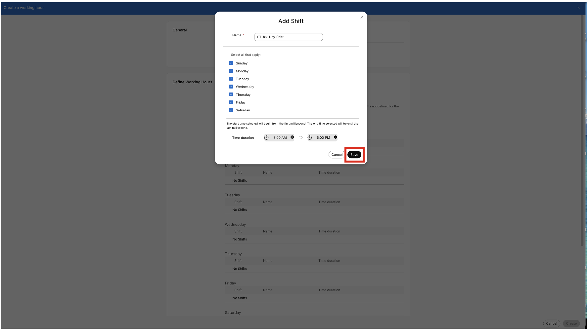

  + Scroll down to Additional Settings 🡪 Holiday List: Select US Holidays
  + Override: Select STUxx\_Override
  + Click “Create”

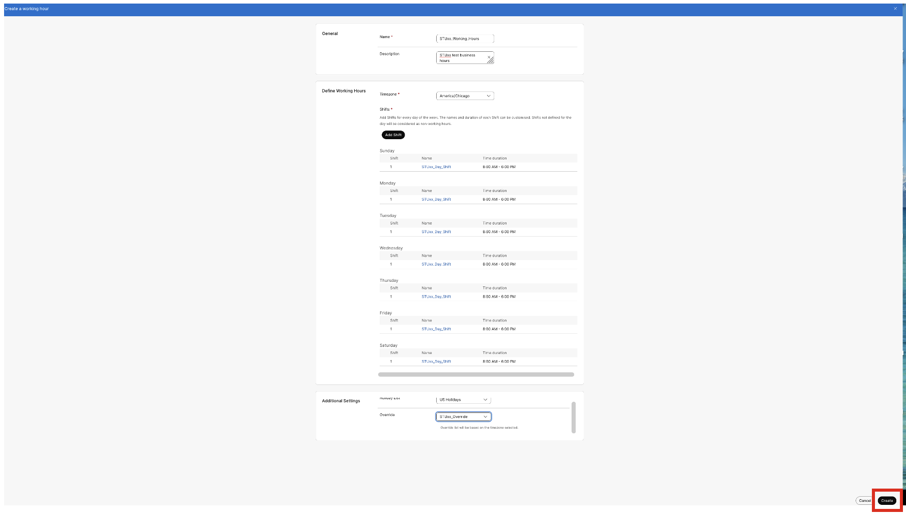

* Within Collaboration Control Hub à Contact Center 🡪 Customer Experience
* Click on “Flows” on Navigation on the left
* Open your “STUxx\_Queue\_Flow\_Lab3” queue flow and put in edit mode
* Disconnect arrow between “NewPhoneContact” node and “Case\_MenuOption” node

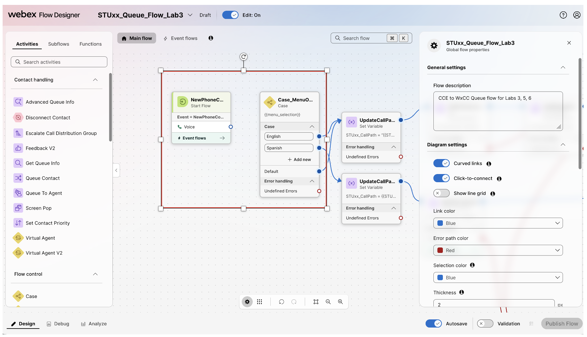

* Drag Business Hours node onto the canvas between the NewPhoneContact” node and “Case\_MenuOption node
* Select new Business Hours node
  + Activity label: BusinessHours\_Queue
  + Description: Testing business hours native node.
  + Select Static Business Hours
    - Note: Variable Business Hours uses the Business Hours ID, not name.
  + Business hour: STUxx\_Working\_Hours from the pull-down menu
  + Select Enable decryption

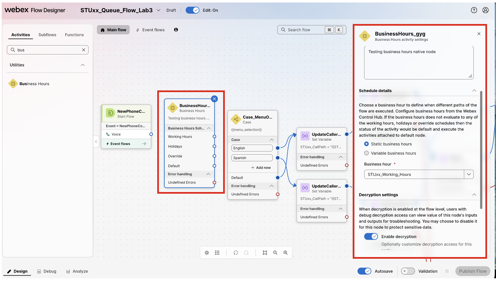

* Connect the “NewPhoneContact” node exit to the new “BusinessHours” node
* Connect the “Working Hours” path to the “Case\_MenuOption” node

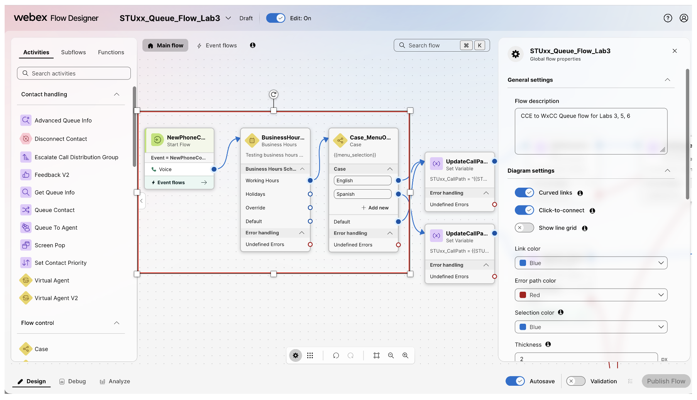

* Drag a “PlayMessage” node on to the canvas
  + Activity label: Closed\_Holiday
  + Activity description: Closed for a holiday
  + Click “Enable text-to-speech”
    - Connector: Cisco Cloud Text-To-Speech
    - Click “Add text-to-speech message”
    - Message: We are closed for the holidays
    - Delete “Audio file”

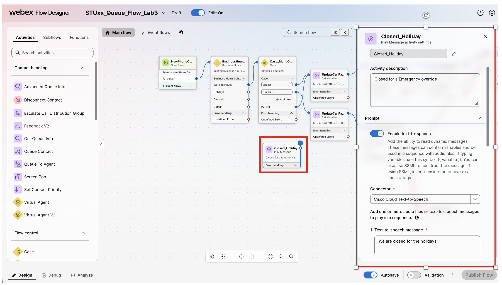

  + Copy/Paste the “Closed\_Holiday” play message node
    - Update the Activity label: Closed\_Override
    - Update the Activity description: Closed for an emergency override
    - Update the text-to-speech message: We are closed for the day

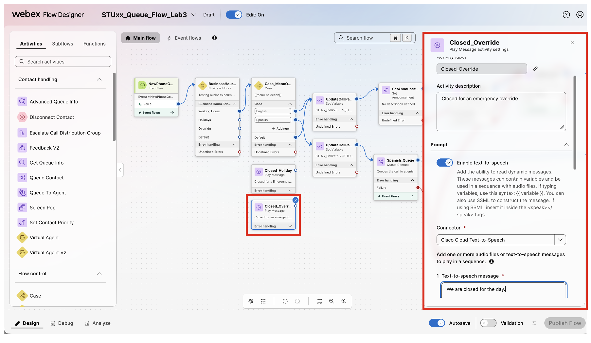

  + Copy/Paste the “Closed\_ Override” play message node
    - Update the Activity label: Closed\_AfterHours
    - Update the Activity description: Outside of normal business hours
    - Update the text-to-speech message: You have reached us during non-business hours. Please call back between 8:00 am and 6:00 pm.

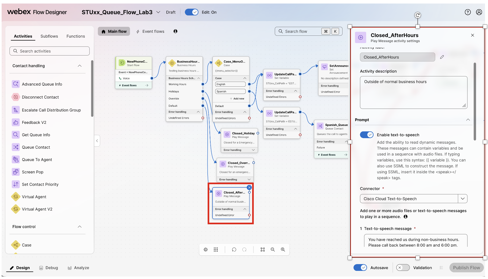

* Copy/Paste the UpdateCallPath\_SpanishQueue node
  + Update Activity label: UpdateCallPath\_Closed
  + Update Variable settings 🡪set value: `{{STUxx\_CallPath}}.BH\_closed`

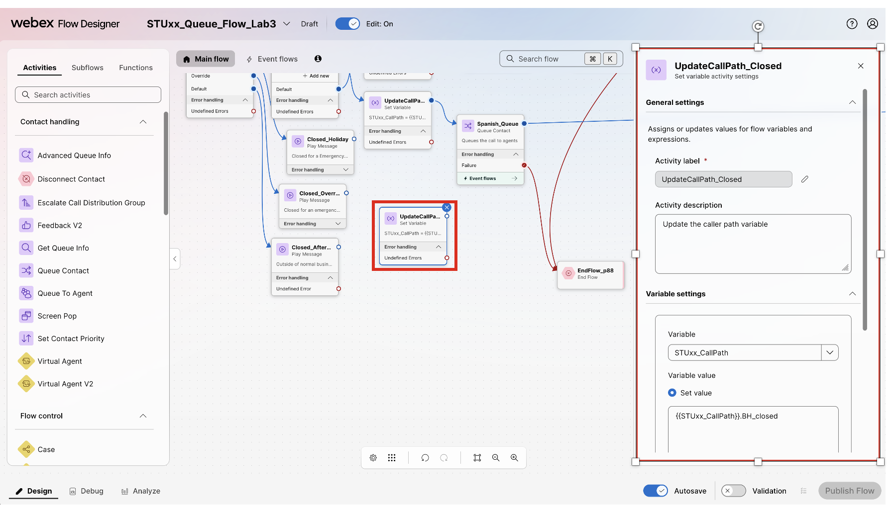

* Drag a “Disconnect Contact” node on to the canvas.
* Connect the UpdatedCallPath\_Closed exit to DisconnectContact node.
* Connect the “Holiday” path from BusinessHours to Closed\_Holiday Play Message node.
* Connect the exit of the Closed\_Holiday play message node to UpdateCallPath\_Closed node.
* Connect the “Default” path from BusinessHours to Closed\_AfterHours message node.
  + Note: “Default” is defined as not working hours, holiday, or override.
* Connect the Closed\_AfterHours message node exit to the UpdateCallPath\_Closed node.
* Connect the “Override” path from BusinessHours to the Closed\_Override play message node.
* Connect the Closed\_Override message node exit to the UpdateCallPath\_Closed node.
* By now your flow may look a bit unruly. Click the 9 dots on the bottom toolbar to neatly rearrange your nodes.

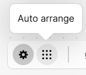

* Click “Validation.” If it throws an error about copied nodes with the same activity label, edit them again and click the checkmark to re-commit the changes.
* Click “Publish Flow” as latest

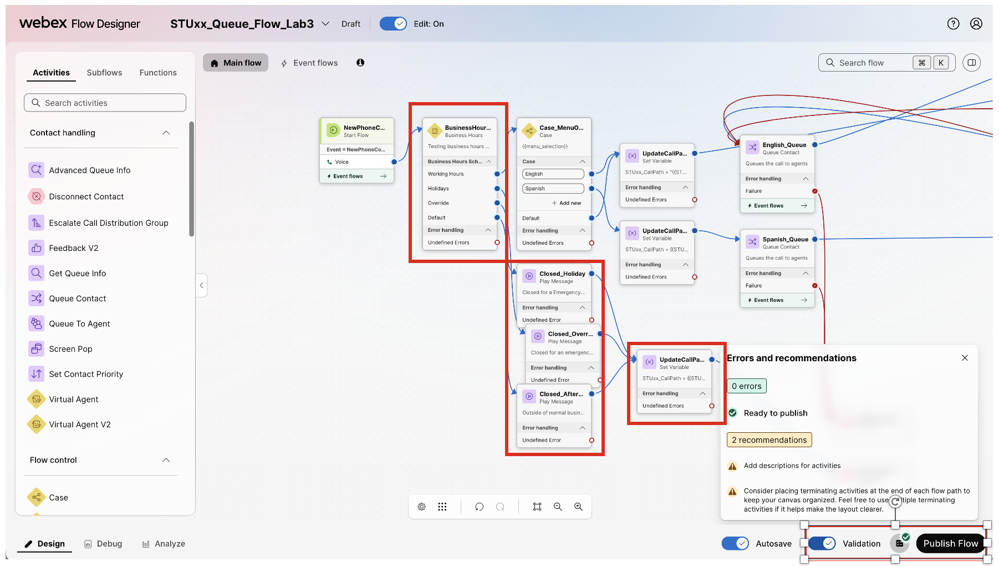

* Make test calls.
  + Adjust business hours, override, holiday in control hub. (instruction to break out 3 calls with changes: Call in hours, Override that day, mod business hours shift to go default.)

## Instructions: Lab 5B – PIQ and EWT

* Open your “STUxx\_Queue\_Flow\_Lab3” queue flow if not open anymore and put in edit mode
* Move your queue loop starting with the “Music” node over to the right to make room for new nodes.
* Disconnect English queue node from the “Music” node.

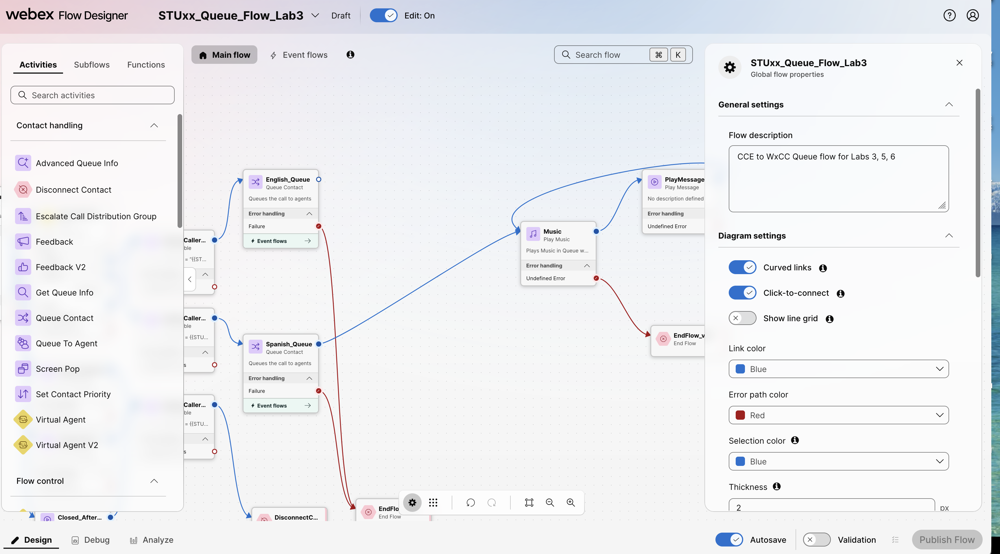

* Drag a “Get Queue Info” node onto canvas
* Connect English queue node to new “GetQueueInfo” node
* Select new GetQueueInfo node
  + Activity label: GetQueueInfo\_English
  + Description: Get the Position (PIQ) and Expected Wait Time (EWT) for team queue
  + Select “Static queue”
  + Select “STUxx\_TeamQueue that was built from the pull-down menu
  + Under Looback time, set EWT Lookback: 5
  + Decryption settings: Enable decryption

* Drag a new “PlayMessage” node
  + Activity label: Play\_PIQ\_EWT
  + Prompt 🡪 Enable text-to-speech
  + Connector: Cisco Cloud Text-To-Speech
  + Click “Add text-to-speech message”: `Your position in queue is {{GetQueueInfo\_English.PIQ}} . Your estimated wait time in {{GetQueueInfo\_English.EWT}}.`
  + Delete Audio file

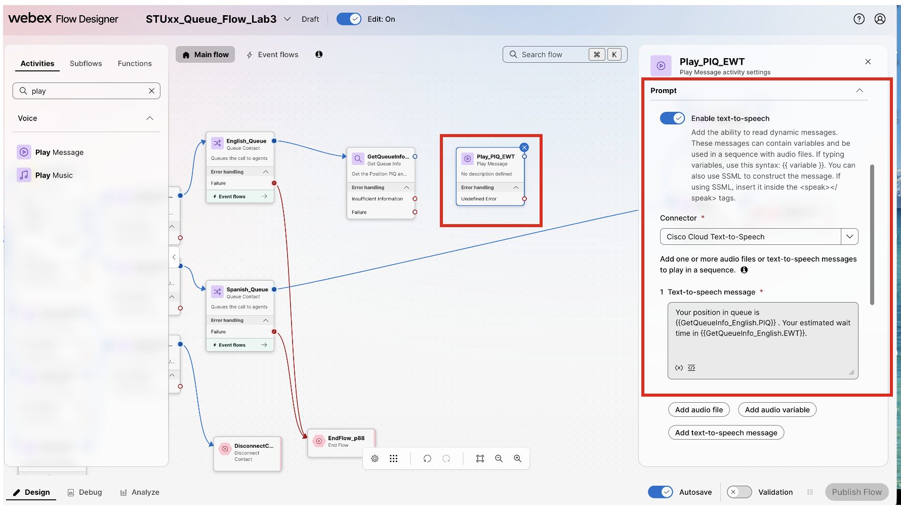

* Connect GetQueueInfo\_English exit path to Play\_PIQ\_EWT node
* Connect “Insufficient Information” path to Music queue loop (bypass 2 new nodes)
* Connect “Failure” path to Music node (bypass new Play\_PIQ\_EWT node)
  + Note: Although optional, highly recommend connecting the 2 failure paths to continue flow.
* Connect “Play\_PIQ\_EWT” exit path to queue “Music” node
* Click “Validation”
* Click “Publish Flow” as Latest

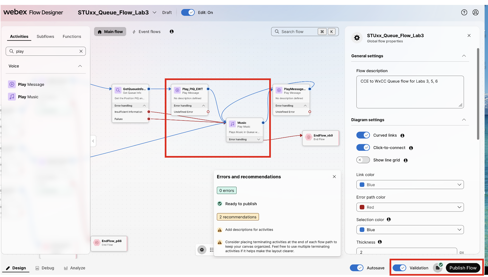

## Instructions: Lab 5C – Courtesy Call Back (CCB)

* Open your STUxx\_Queue\_Flow\_Lab3 flow if not open anymore and put in edit mode
* Move your queue loop starting with the play music node over to make room for new nodes.
* Disconnect Play\_PIQ\_EWT exit to queue loop music node
* Drag a “Menu” node and a “Callback” node to the canvas between the Play\_PIQ\_EWT and Music nodes.
* Connect the Play\_PIQ\_EWT exit to the new “Menu” node
* Select the new Menu node
  + Activity label: Queue\_Options
  + Activity description: Provide call deflection options in queue
  + Prompt 🡪 Enable text-to-speech
  + Connector: Cisco Cloud Text-To-Speech
  + Click “Add text-to-speech message”: If you would like a callback, press 1. Your place will be kept in queue.
  + Delete Audio file
  + Check “Make prompt interruptible”
  + Custom menu links 🡪 “DIGIT NUMBER”: 1
  + Custom menu links 🡪 LINK DESCRIPTION”: CCB
* Connect CCB path to Callback node

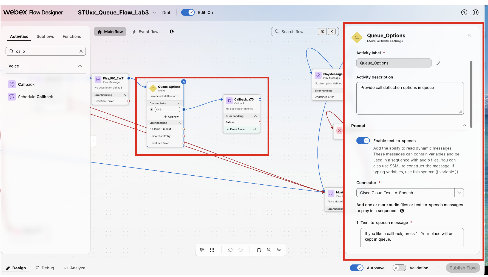

* Connect “No-Input Timeout” and “Undefined Error” exit path to Music node
* Connect the Unmatched Entry path back to the Queue\_Options menu node (itself)

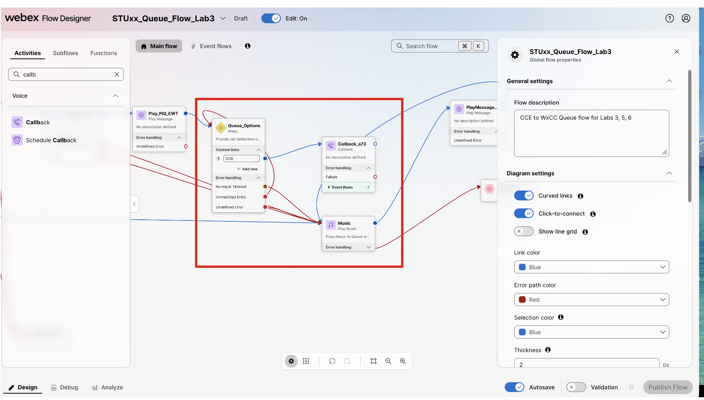

* Select “Callback” node
  + Activity label: CCB
  + Activity description: Standard Webex Contact Center Courtesy Call Back
  + “Callback settings 🡪 Callback dial number: no changes
  + Deselect “Register callback to different destination?”
    - (Optional) If keep on, select STUxx\_TeamQueue so the call will be sent to your queue when an agent becomes available.
  + Select “Static ANI” and first number on the Callback ANI
* Connect CCB node failure path to queue loop “Music” node

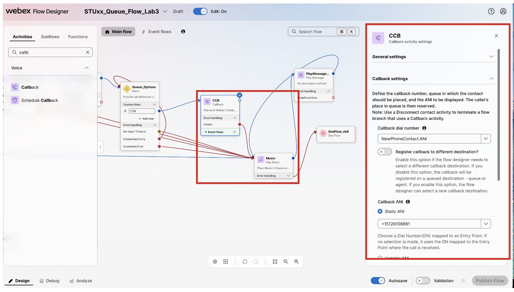

* Copy/Paste the UpdateCallPath\_Closed node
  + Activity label: UpdateCallPath\_CCB
  + Variable settings 🡪 Set value: `{{STUxx\_CallPath}}.CCB`

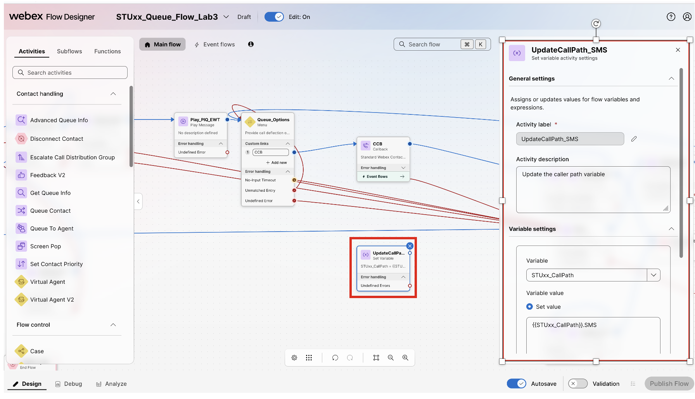

* Add a new PlayMessage node
  + Activity label: CCB\_Message
  + Activity description: TTS Message played to caller
  + Prompt 🡪 Enable text-to-speech
  + Connector: Cisco Cloud Text-To-Speech
  + Click “Add text-to-speech message”: You have been tagged for callback. Talk to you soon.
  + Delete Audio file

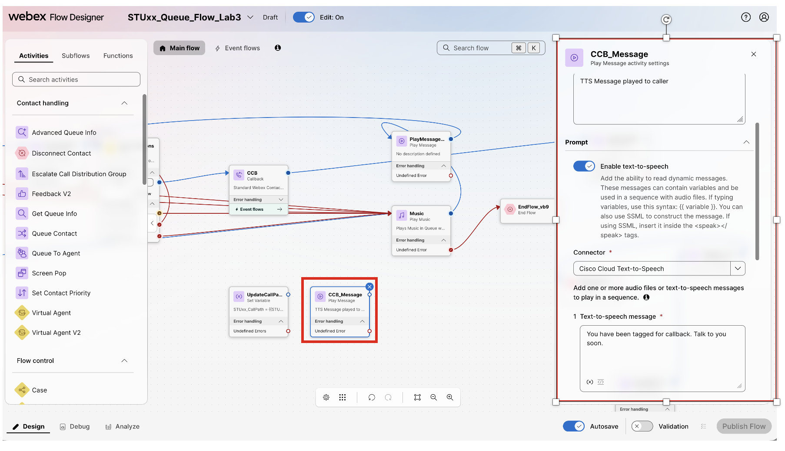

* Drag a DisconnectContact node on to the canvas
* Connect the “CCB” node exit path to UpdateCallPath\_CCB
* Connect the “UpdateCallPath\_CCB” to the “CCB\_Message” node.
* Connect the “CCB\_Message” node exit path to the “DisconnectContact” node.
* Disconnect “PlayMessage” node’s output line going back to the “Music” node shown in the below screenshot

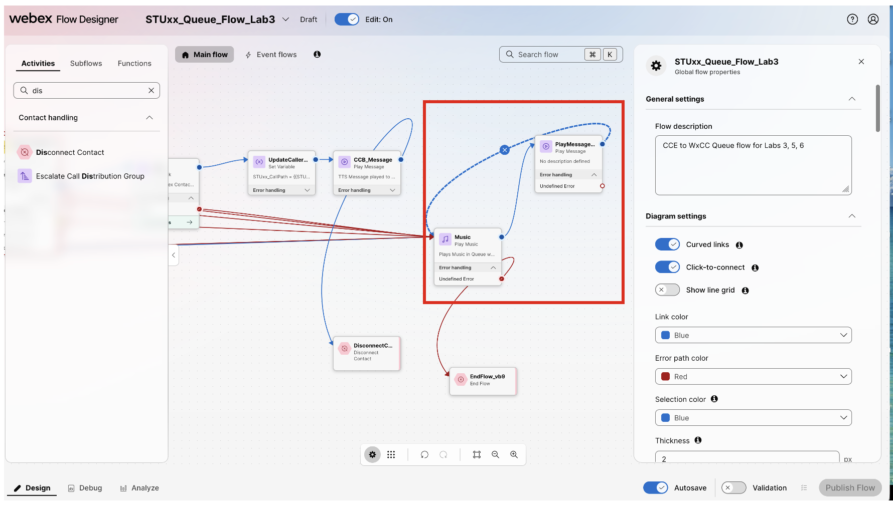

* Connect the “PlayMessage” node exit path to the “Queue\_Options” node.

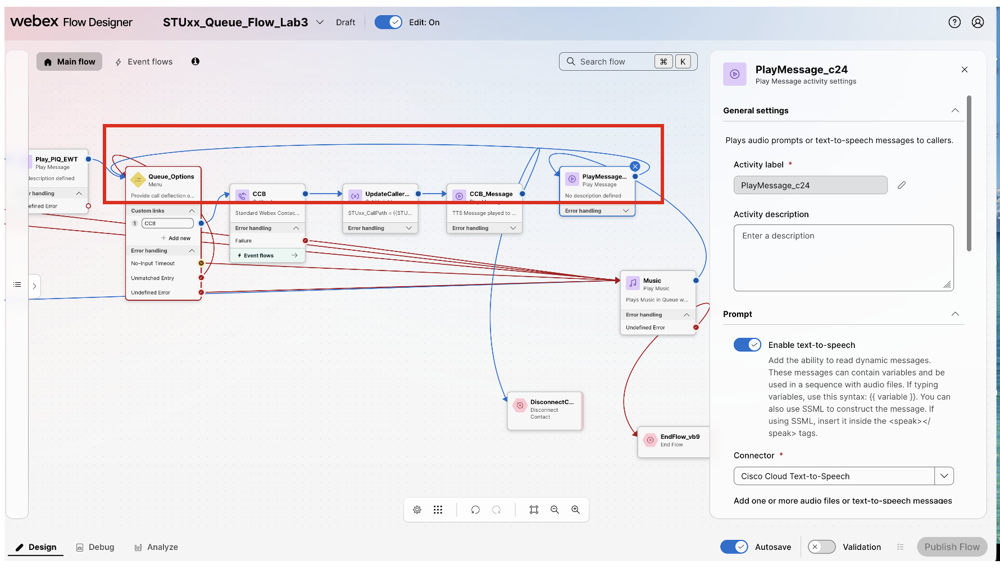

* Click “Validation”
* Use the 9 dots square at the bottom to automatically arrange the nodes in your flow.
* Click “Publish Flow” and latest

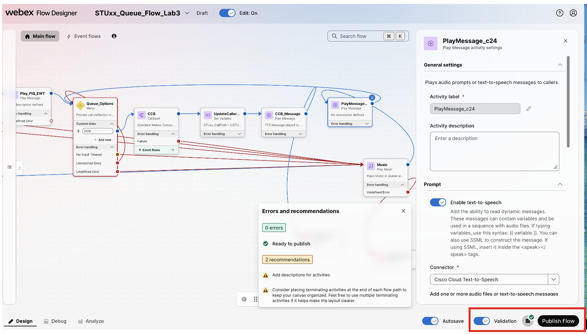

## Instructions: Lab 5D – Whisper and Compliance Message

* Within Collaboration Control Hub à Contact Center 🡪 Customer Experience
* Click on “Audio Files” from navigation panel on left.
* Select “Agent personal greetings” tab
* Download the audio
  + Click on “joewon Agent”
  + Click the download arrow  to get the test audio file.

* Go back to the Agent personal greeting page
* Click on “Create a personal greeting”
  + Agent: Select your STUxx\_Agent
  + Greeting purpose: Default
  + Choose and upload the TestGreeting audio file you downloaded
  + Click create. If the button is still grayed out, re-select Default in the Greeting Purpose dropdown.
* Open your “STUxx\_Queue\_Flow\_Lab3” flow if not open anymore and put in edit mode
* Drag a “Set Announcement” node and a “Set Whisper Announcement” node onto canvas near the Case\_MenuOption node
* Select the SetAnnouncement node
  + Activity label: SetAnnouncement
  + Description: (optional)
  + Agent Greeting: Enable agent greeting
    - Greeting purpose: Default
  + Compliance message: Enable compliance message
    - Select “ComplianceMessage.wav” file from pulldown
  + Enable decryption

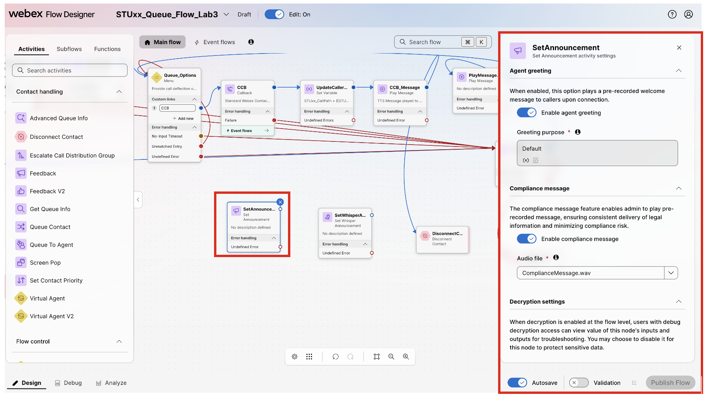

* Disconnect the UpdateCallPath\_EnglishQueue exit path from the EnglishQueue. Instead, connect it to the new SetAnnouncement node.

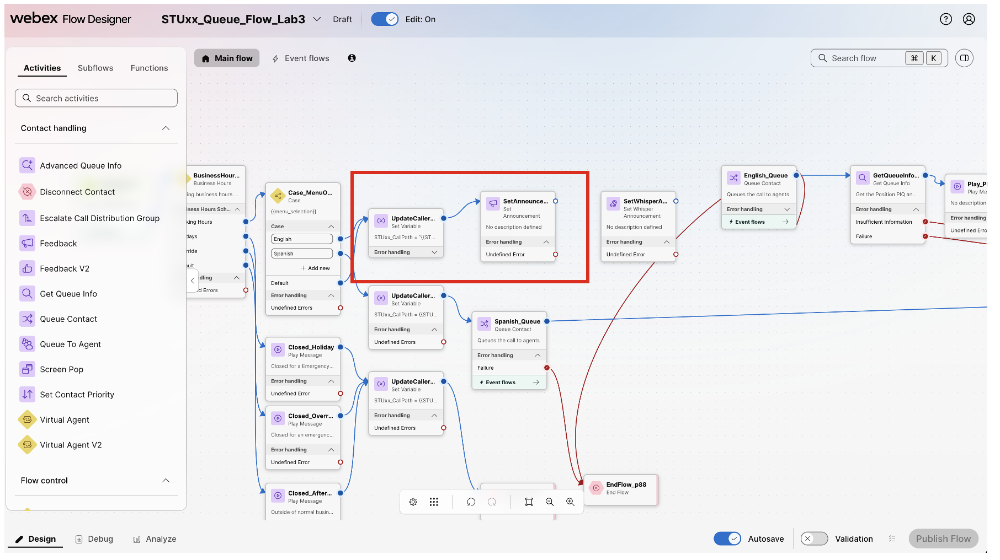

* Select the new SetWhisperAnnouncement node
  + Activity label: SetWhisperAnnouncement
  + Description: (optional)
  + Enable Text-to-speech
  + Connector: Cisco cloud Text-to-Speech
  + Click Add text-to-speech message and set it to: `You are connecting to {{callerFirstName}} who speaks {{callerLanguage}}.`
  + Delete “Audio file”

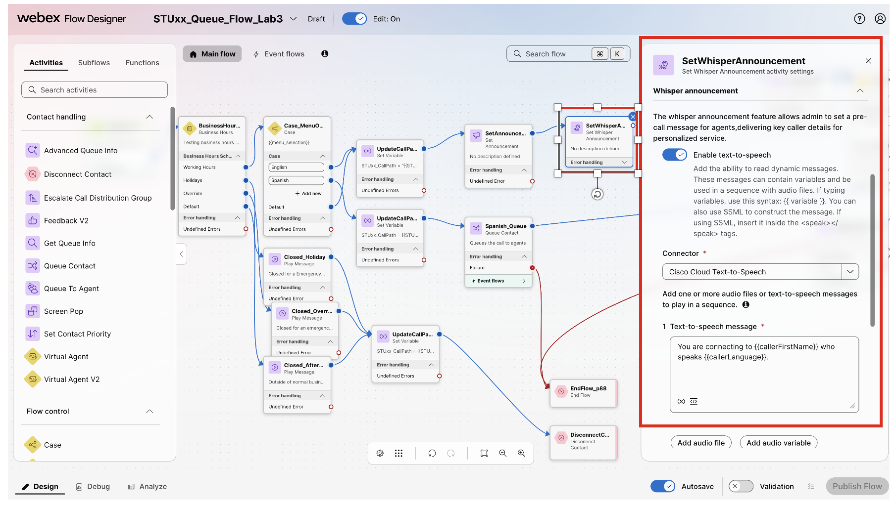

* Connect the SetAnnouncement exit path to the SetWhisperAnnouncement node.
* Connect the SetWhisperAnnouncement node exit path to the English\_Queue node.
* (optional) Connect the 2 Undefined Error paths to the English\_Queue node so call does not end abruptly for caller on announcement errors.
* Click “Validation”
* Click “Publish Flow” as latest

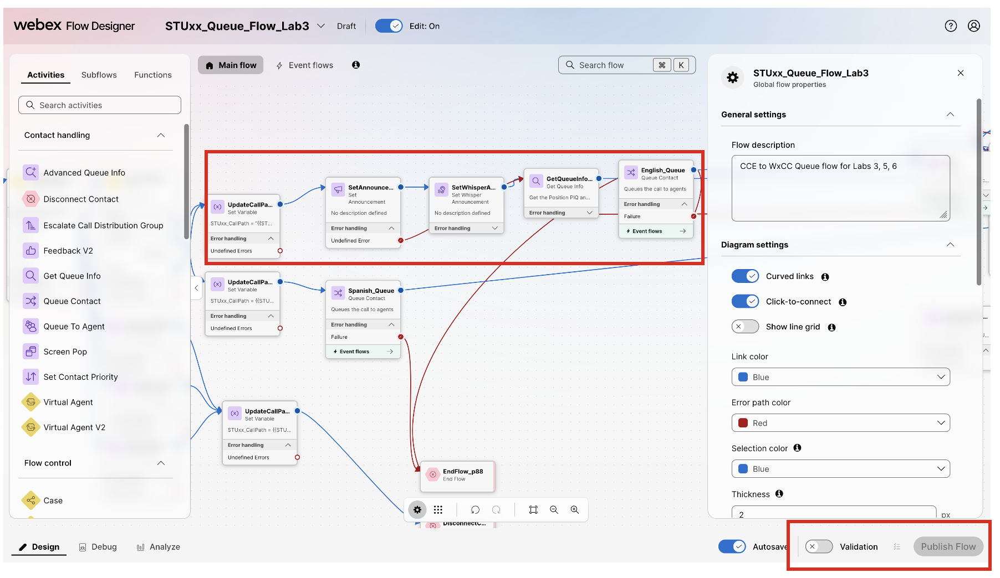

* Ensure your agent is logged in and Available
* Make test call and ask Megan to transfer you to a human agent to hear the newly-added messages:
  + Whisper greeting is only heard by agent.
  + Compliance message is heard by both caller and agent.
  + Agent greeting is heard by both caller and agent
* (Optional) Toggle the announcements on and off and make test calls to see the difference.
* End the call and select any available wrap-up code.

## Instructions: Lab 5E – Transcription/Screen Pop and Event flows

* Within Collaboration Control Hub à Contact Center 🡪 Desktop Experience
* Click on “AI Features” from navigation panel on left.
* Confirm “Real-Time Transcription” is turned on and “Apply to all queues”
  + Note: This is allowing it (or disallowing it). There is still another setting to trigger transcription in a flow.

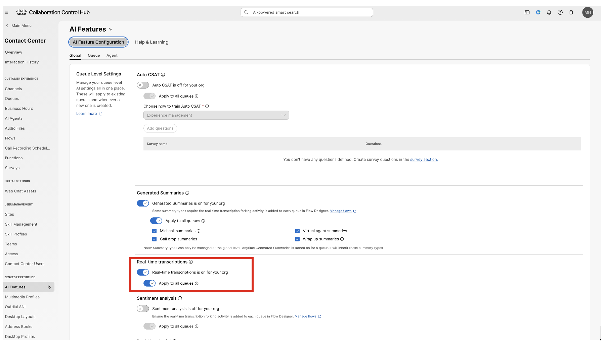

* Open your “STUxx\_Queue\_Flow\_Lab3” queue flow if not open anymore and put in edit mode
* Click on the Event Flows Tab
* On AgentAnswered node, delete the connector to the screenpop node. Drag it and the EndFlow node to the right to make room for a new node
* Drag “Start Media Stream” node to canvas
* Connect the AgentAnswered node exit to the new StartMediaStream node
* Connect the new StartMediaStream node to existing screenpop node
* Select existing screenpop node (Optional: copy and paste a new screen pop node)
  + Activity label: ScreenPop\_WxOne
  + Activity description: Opens a default screen pop pointing to Webex One.
  + Replace screen pop url: <https://www.webexone.com/>
  + Replace Screen Pop Desktop Label: Webex One 2026
  + Screen Pop loading behavior: (optional change)

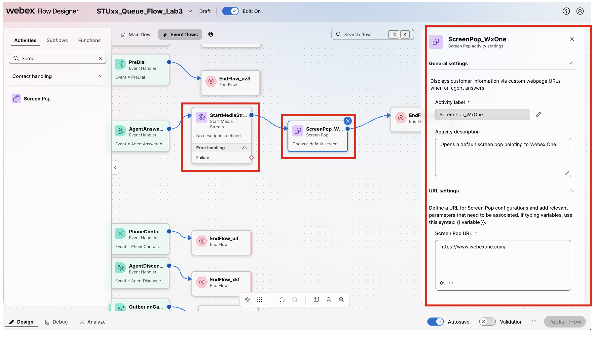

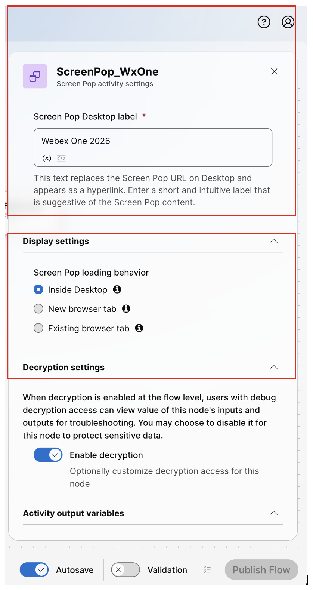

* Click “Main Flow” tab
* Copy the UpdateCallPath\_CCB node
* Click “Event Flows” tab
* Paste the UpdateCallPath\_CCB into the Event Flows Canvas
  + Note: you can do this between flows also but both have to be in Edit mode
* Find the newly pasted node 😊 by zooming out or clicking the 9 dots to make it appear at the bottom of the green trigger nodes. Move it near the PhoneContactEnded event node.
  + Activity label: UpdateCallPath\_CallerHangup
  + Update set value: `{{STUxx\_CallPath}}.CallerHangUp`
* Insert the UpdateCallPath\_CallerHangUp between PhoneContactEnded event node and Endflow node

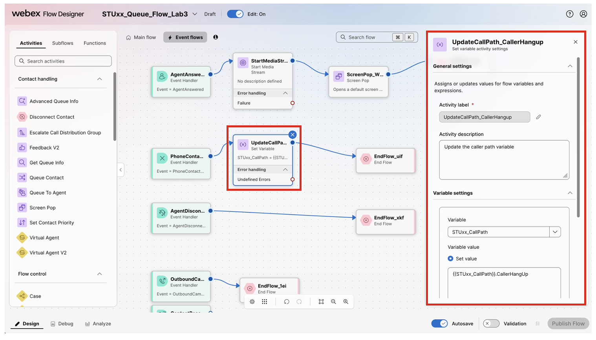

* Copy/Paste UpdateCallPath\_CallerHangUp
  + Activity label: UpdateCallPath\_AgentHangUp
  + Update set value: `{{STUxx\_CallPath}}.AgentHangUp`
* Insert the UpdateCallPath\_AgentHangUp between AgentDisconnected event node and Endflow node
* Click Validation
* Click Publish Flow as latest

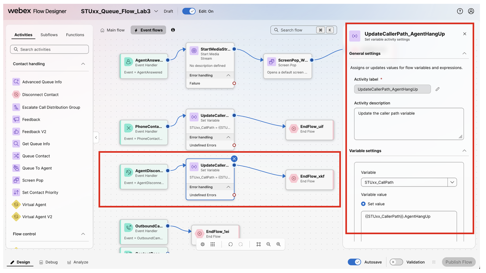

* Make test call in and ask to speak to a human agent
  + Notice live transcription is working now
  + Notice screen pop has changed

Add Screenshot of the agent desktop once agents are created.

## Finish Lab 5
