# Lab 6 - Custom Global Variable Reporting

## Objectives:

* Learn how to do Call Type equivalent non-queue reporting using the global variables configured in previous labs
* Introduction to WxCC reporting module as compared to CUIC
  + Understanding terminology and how they differ from CUIC.
  + Explore standard and “transition” reports used to help migrations.
* Configure and modify several simple custom reports to meet equivalent CCE reporting requirements.

## Prerequisites:

* Complete Labs 2-5

## Instructions: Lab 6

* Within Collaboration Control Hub à Contact Center à Customer Experience
* Click on “Flows”
* Open “STUxx\_Lab4” IVR flow and place in edit mode
* Update the flow name: STUxx\_Lab6
  + Click “Save”
* Click on “WelcomeMessage” node and update the “Text-to-speech message”: You have reached lab 6 flow where we are working on Webex Contact Center Analyzer reporting.

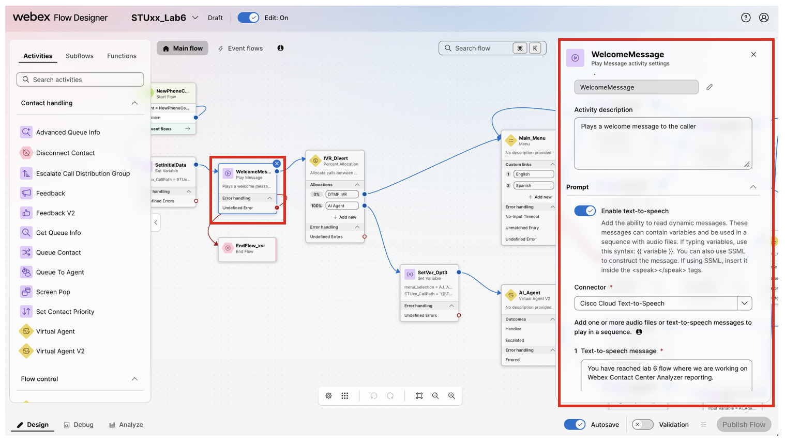

* Click on the “IVR\_Divert” mode and move the IVR\_Divert node allocation to 100% DTMF IVR option and 0% AI Agent

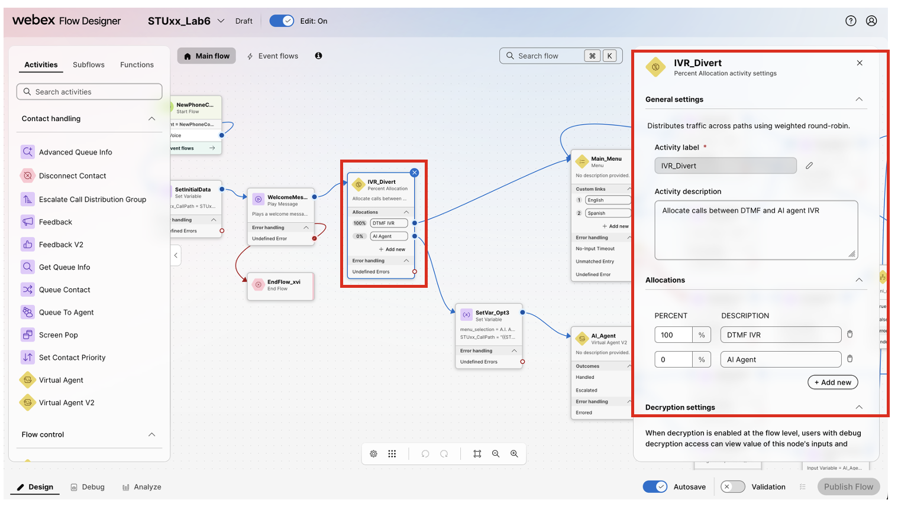

* Click on the Main\_Menu node
  + Update TTS for menu to insert:
    - Press 3 for AI Agent.
    - Press 4 to transfer externally
    - Otherwise, stay on the phone

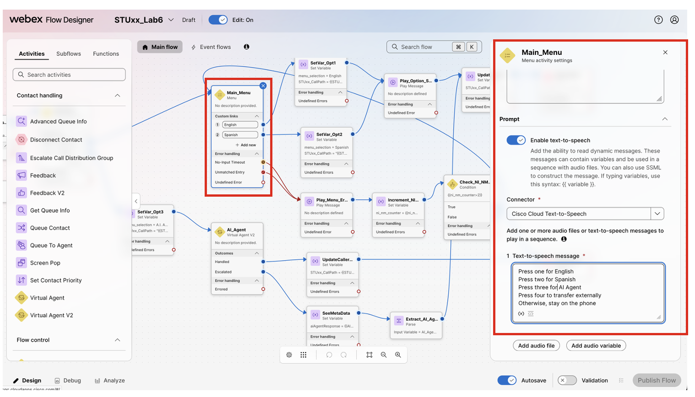

  + Under the “Custom menu links” section
    - Click an “+ Add new” for a new menu option
      * Select “3” for Digit Number
      * Update Link Description to: AI Agent
    - Click an “+ Add new” for a new menu option
      * Select “4” for Digit Number
      * Update Link Description to: External Transfer

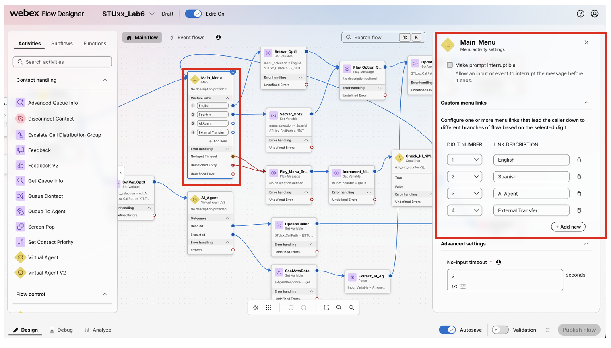

* Copy/Paste the SetVar\_Opt3 node
* Select the new SetVar node
  + Activity label: SetVar\_Opt4
  + For the menu\_selection variable, set value: “External Transfer”

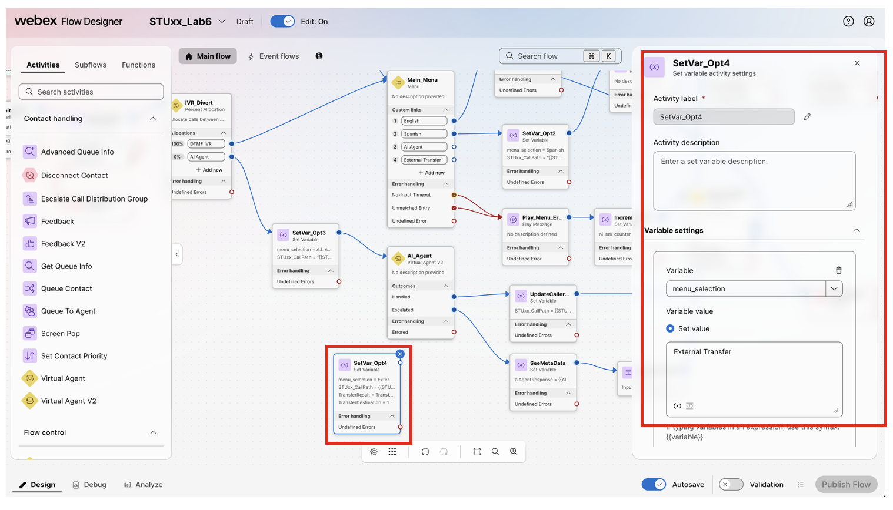

  + For the STUxx\_CallPath variable, set value: `{{STUxx\_CallPath}}.externaltransfer`
  + Click on “+Add new” for new variable to set
  + Select “TransferResult” global variable
  + Update the set value to: “TransferComplete”

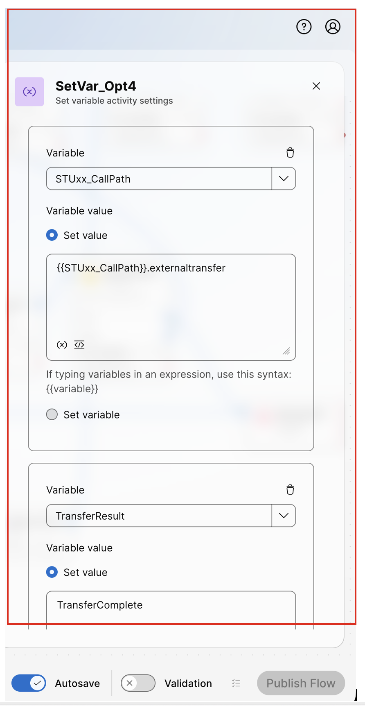

  + Click on “+Add new” for new variable to set
  + Select “TransferDestination” global variable
  + Update the set value to: “18186270745”

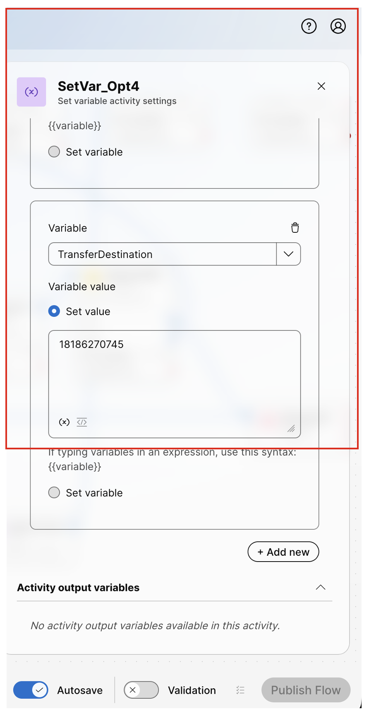

* Drag a Bridged Transfer node to the canvas
* Select the Bridged Transfer node
  + Activity label: BridgedTransfer\_External
  + Click on “Variable dial number”
  + Select “TransferDestination” from pull down

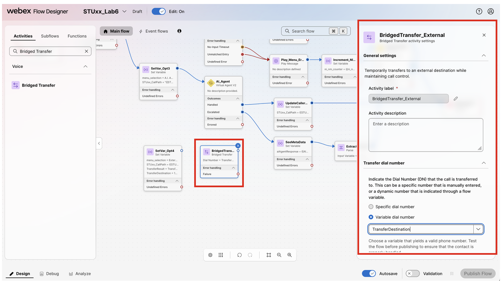

* Drag a Set Variable Node to the canvas
* Select the new Set Variable node
  + Activity label: SetVar\_TransferResult\_Fail
  + Variable settings à Variable: TransferResult
  + Enter Set Value: `Failed: {{BridgedTransfer\_External.FailureDescription}} ({{BridgedTransfer\_External.FailureCode}}`

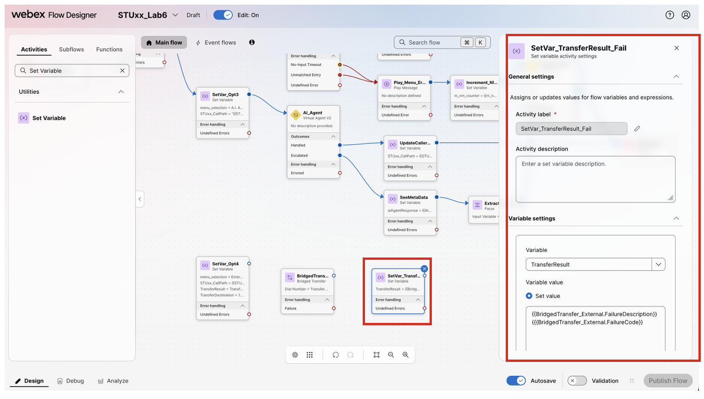

* Connect the Main\_Menu AI Agent option 3 path to the SetVar\_Opt3 node.

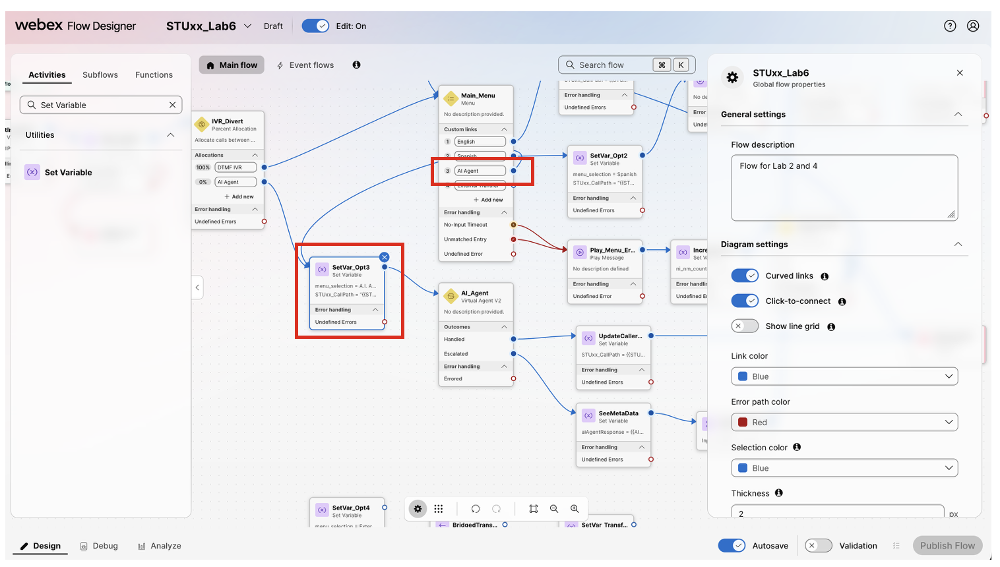

* Connect the Main\_Menu External Transfer option 4 path to the SetVar\_Opt4 node.
* Connect the SetVar\_Opt4 exit to the BridgedTransfer\_External node.
* Connect the BridgedTransfer\_External exit path to a DisconnectContact node
* Connect the BridgedTransfer\_External failure path to the SetVar\_Transfer\_Fail node
* Connect the SetVar\_Transfer\_Fail node to the UpdateCallPath\_Queue node.

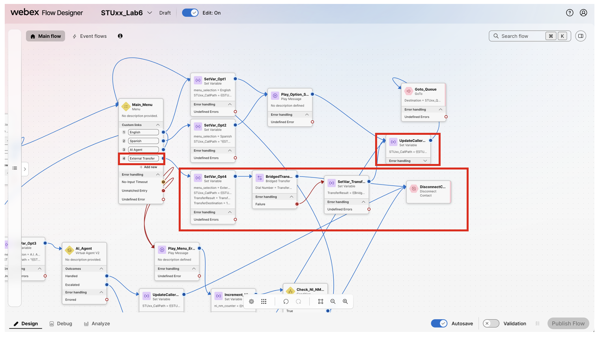

* Click Validation
* Use the 9 dots to neatly arrange your flow with the newly-added nodes.
* Click Publish Flow as Latest

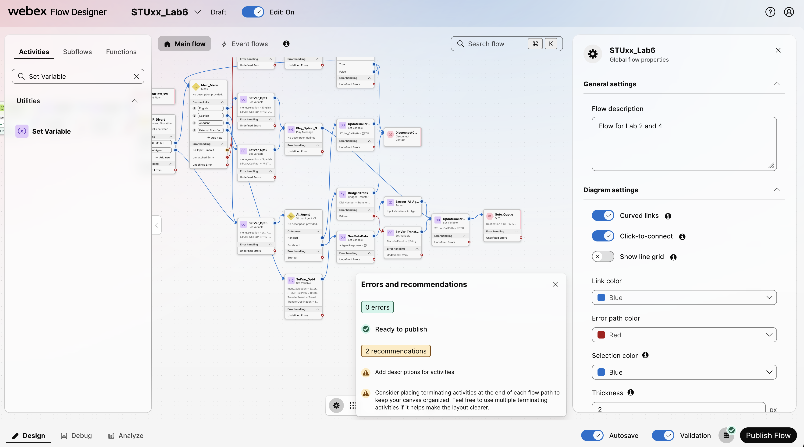

* Make some test calls to option 4.
  + Feel free to change the number to your flows number or another number to test success.
* Within Collaboration Control Hub à Contact Center à Overview à Quick Links
* Click on Analyzer
  + This will cross-launch the analyzer reporting module
* On the upper hand corner of the screen Click “Create new” and select “Folder”
* Name the folder: “STUxx\_Reports”
* Click Create

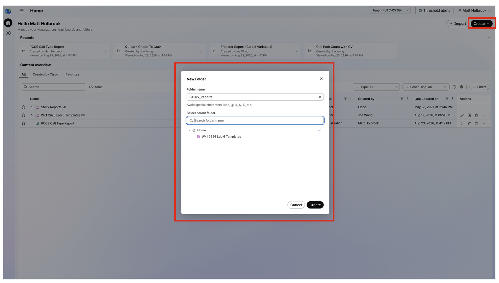

* Double click into the “Wx1 2026 Lab 6 Templates” Folder
* Click on the 3 dots on the right of the “Call Path Count with GV” report
  + Select Export
  + Select Template

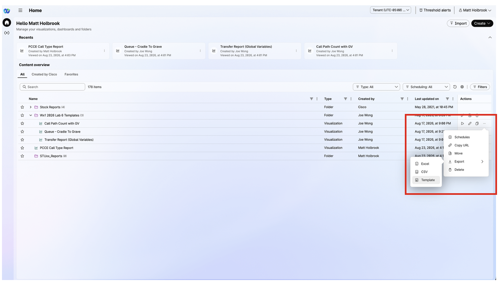

* Click on the 3 dots in the “Queue-Cradle To Grave” report
  + Select Export
  + Select Template
* Click on the 3 dots in the “Transfer Report (Global Variables)” report
  + Select Export
  + Select Template
* Click on “Import” button on top right corner of the screen
  + Browse and select “Call Path count with GV.json” file
  + Select your STUxx\_Reports folder
  + Click Import

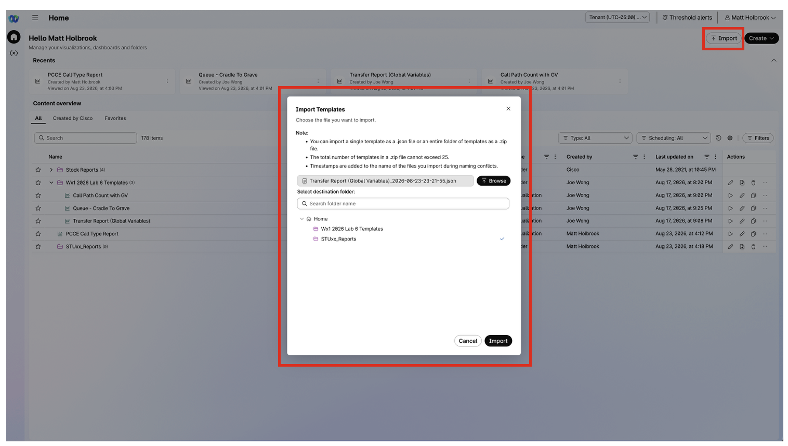

* Repeat for the other 2 reports
* Click on the 3 dots for “Call Path Count with GV” report
* Click Edit (pencil icon)
* Click Edit to the right of “Module1”
  + Change Name to Call Path
  + Click “OK”
* Click the down arrow next to “start Time” and select “This Year”
* Delete “CallerIntent” under “+Row Segments”
* Click on “+Row Segments” button
* Search/Find your “STUxx\_CallPath” variable from the list.
* Click and drag to area under the “+Row Segments”
* Click “Save”
* Click “Preview”

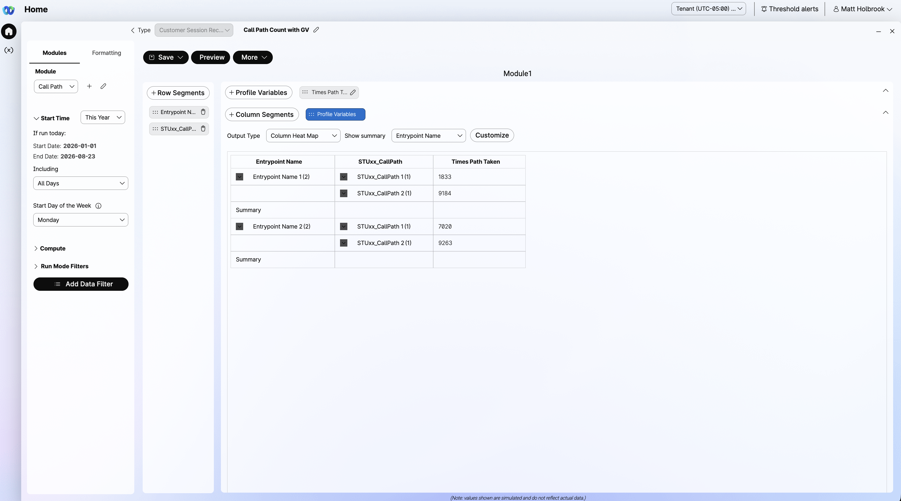

* Click on “X” in upper right to go back to folder.
* Click on the 3 dots for “Call Path Count with GV” report
* Select “Schedules”
  + Job Name: STUxx\_Test\_Report
  + Start Date: current date
  + Timestamp: closest 15-minute time interval
  + Timezone: (-05:00) US/Central
  + Recurrence: Never
  + Email: Enter your email address
  + Subject: Test email from Analyzer
  + Message: Test report of Call Path Count with GV for today”
  + Output: Excel
  + Click Save

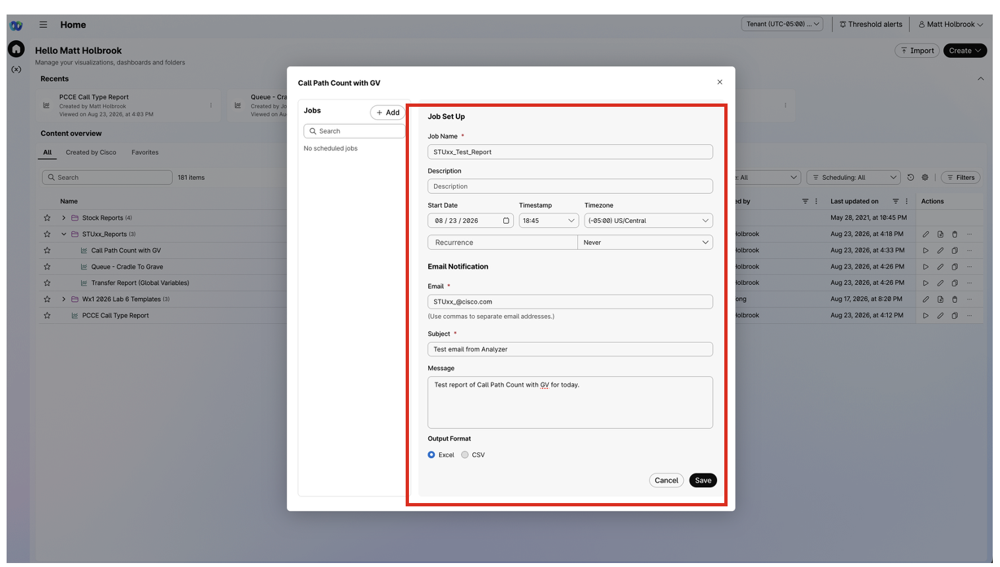

* Click “Edit” for “Transfer Report (Global Variables)” report
  + Expand “Run Mode Filters” on the left side menu
* Uncheck “Transfer Count” and “Transfer Results Count”
* Check “Entrypoint Name”

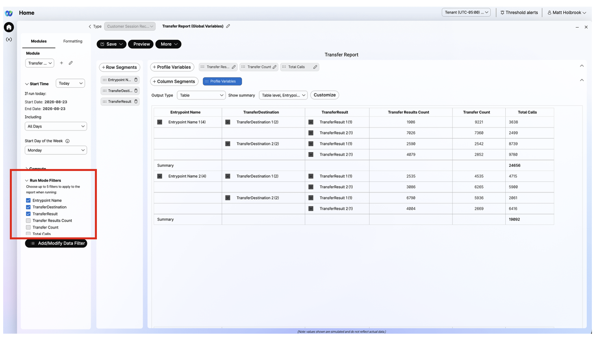

* Click on “Add/Modify Data Filter” button
  + Click on “Select field or measurement” and Select ‘[ACD] TransferDestination”
  + Click on “Select condition” and select “Does not contain”
  + Click on the blank condition field and select “(Blank)”
  + Click Save

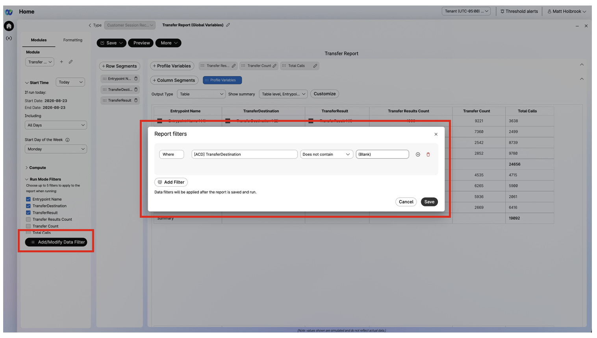

* Click the down arrow next to “Start Time” and select “This Year”
* Click Save button
* Click Preview button
* Click on “X” in upper right to go back to folder.
* Double click to run the “Queue – Cradle to Grave” semi-custom report

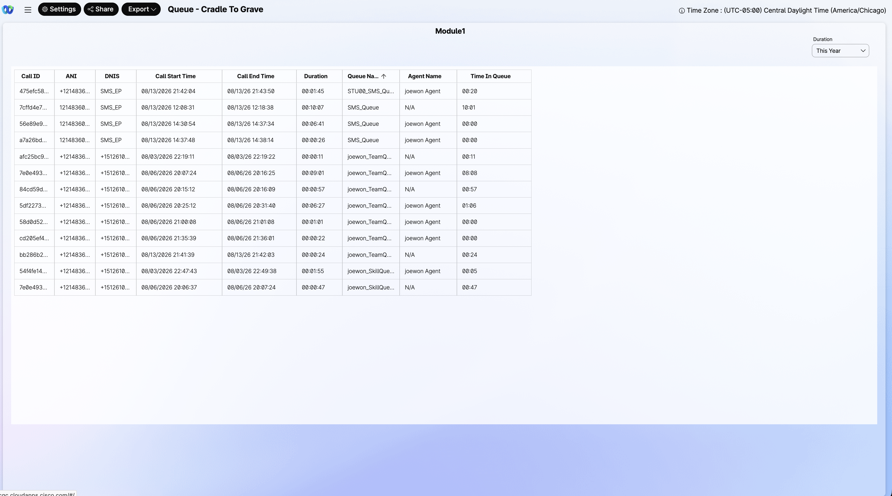

* Feel free to explore Visualization Stock Reports and Dashboard Stock Dashboards

## Finish Lab 6
