# Lab 7 - SMS to Queue (Bonus)

## Objectives:

* Configure additional queue option to deflect caller to digital (SMS) queue.
  + Configure an SMS queue with unified routing to same agent.
* Understand any supporting configurations for digital channel queues.
  + Use of Webex Connect to manage the interaction. (Same as CCE)
  + Desktop Media Profiles
* Deliver a voice call to queue, redirect to SMS queue, to SMS enabled agent on WxCC native desktop.

## Prerequisites:

* Complete Labs 3 and 5
* Instructor to provide Premium Agent Licensing to student agent account.

## Instructions: Lab 7

* Within Collaboration Control Hub à Contact Center à Customer Experience
* Click on Queues
* Click on the prebuilt SMS queue associated with your student ID (STUxx\_SMS\_Queue)
  + Edit (pencil) Group 1 in the Conversation distribution section

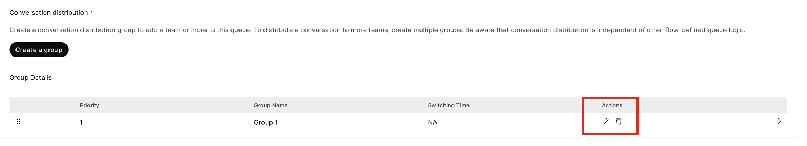

  + - Remove “Sandbox Team AgentType” Team
    - Check one or more of your built teams
    - Click Save

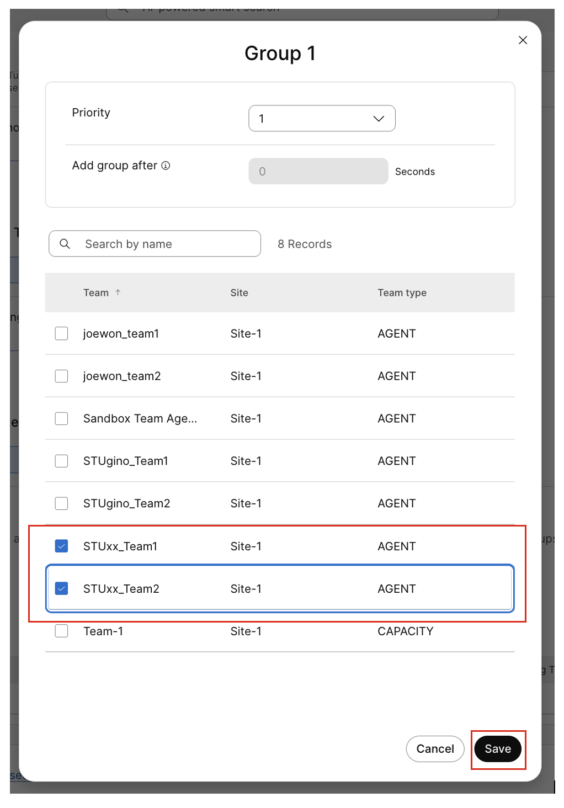

  + Click Save

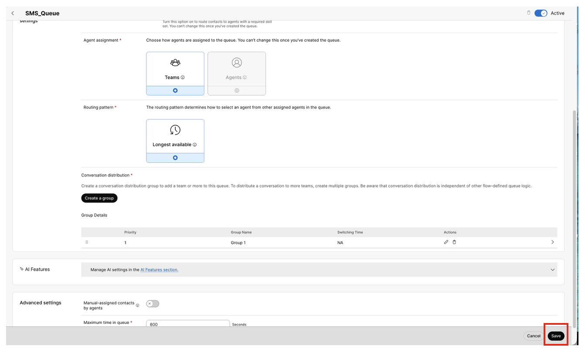

* Within Collaboration Control Hub à Contact Center à Customer Experience
* Click on Flows
* Open your queue flow (STUxx\_Queue\_Flow) and put in edit mode
* Click on Queue\_Options node
  + Update the Text-to-speech message by adding “If you would like to text to one of our SMS enabled agents, press 2.”

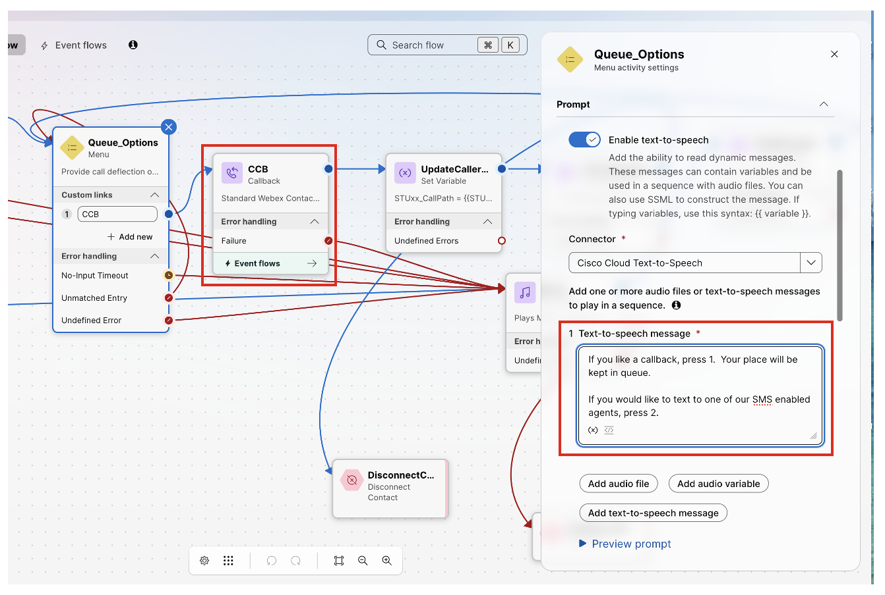

  + Click on “+ Add new” under Custom menu links
  + Select “2” from the Digit Number pulldown
  + Rename the Link Description to “SMS\_Queue”

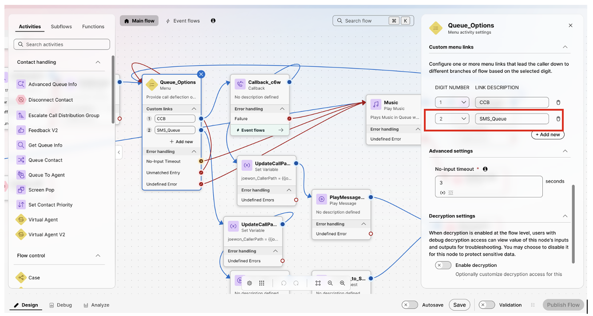

* Copy/Paste the UpdateCallPath\_CCB node
  + Activity label: UpdateCallPath\_SMS
  + Update set value to: `{{STUxx_CallPath}}.SMS`

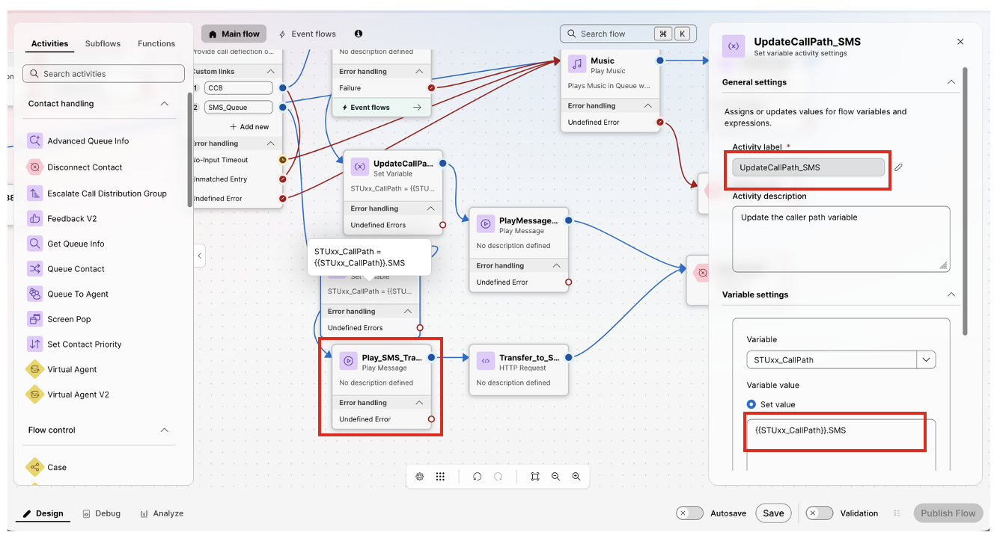

* Drag a Play Message node and an HTTP Request node to the canvas
* Select the PlayMessage node
  + Activity label: Play\_SMS\_Transfer (remember to click the )
  + Enable Text-to-Speech
  + Connector: “Cisco Cloud Text-to-Speech
  + Click Add text-to-speech message: “Transferring you to your SMS queue.”
  + Delete the “Audio file”

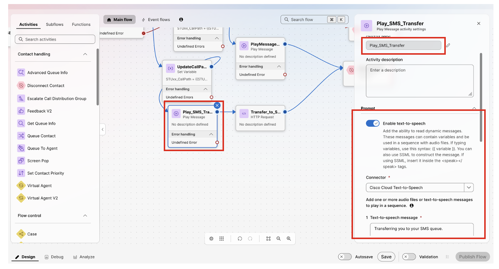

* Connect the SMS\_Queue path from the Queue\_Options to the UpdateCallerPath\_SMS node
* Connect the UpdateCallPath\_SMS exit to the new Play\_SMS\_Transfer node.
* Connect the Play\_SMS\_Transfer node exit to the new, unconfigured HTTPRequest node

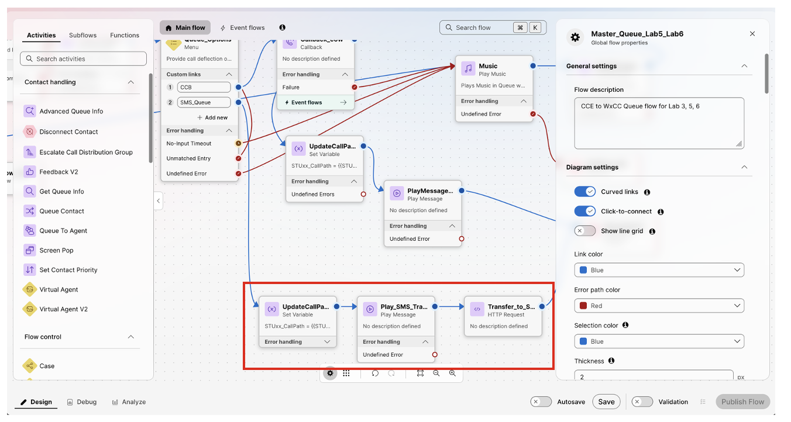

* Click on the HTTPRequest node
  + Activity label to: Transfer\_to\_SMS
  + Uncheck “Use authenticated endpoint”
  + Request URL: <https://hooks.us.webexconnect.io/events/5T8RM8756B>
  + Method: POST

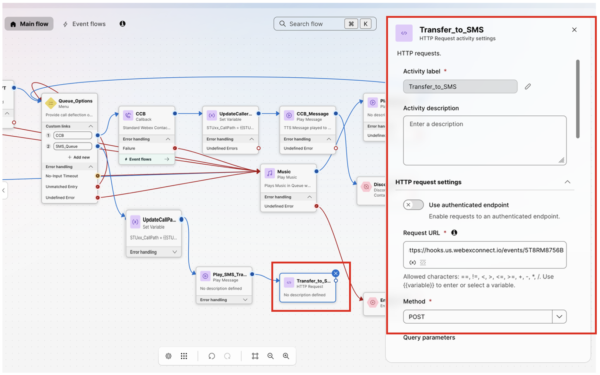

  + Add 1 HTTP request headers (“+ Add new) button

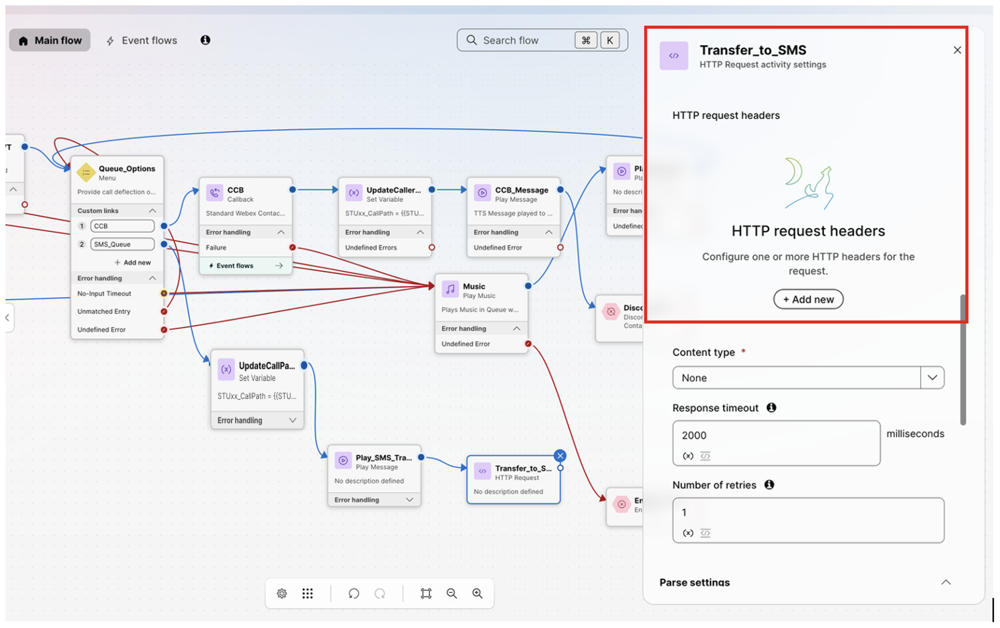

  + - Key: Key
    - Value: eb46ec95-89ec-11f1-bc22-02568a99fbcf
  + Content type: Application/JSON
  + Request body:

{

"phone": "12148360352",

"message": "This is a transfer from your voice queue.",

"studentID": "STUxx"

}

  + - REPLACE “xx” with student ID number

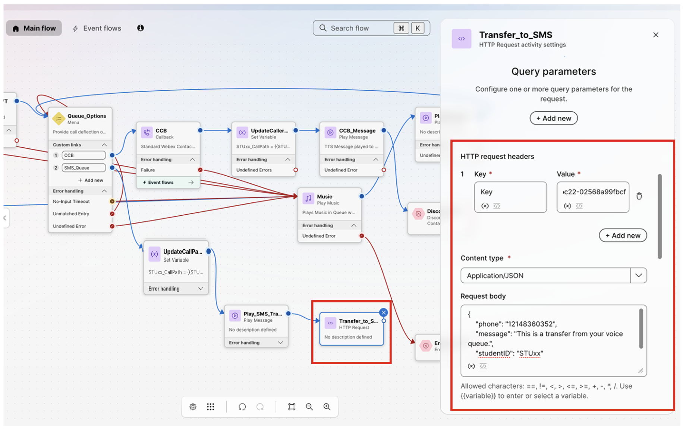

  + Select “Enable decryption”

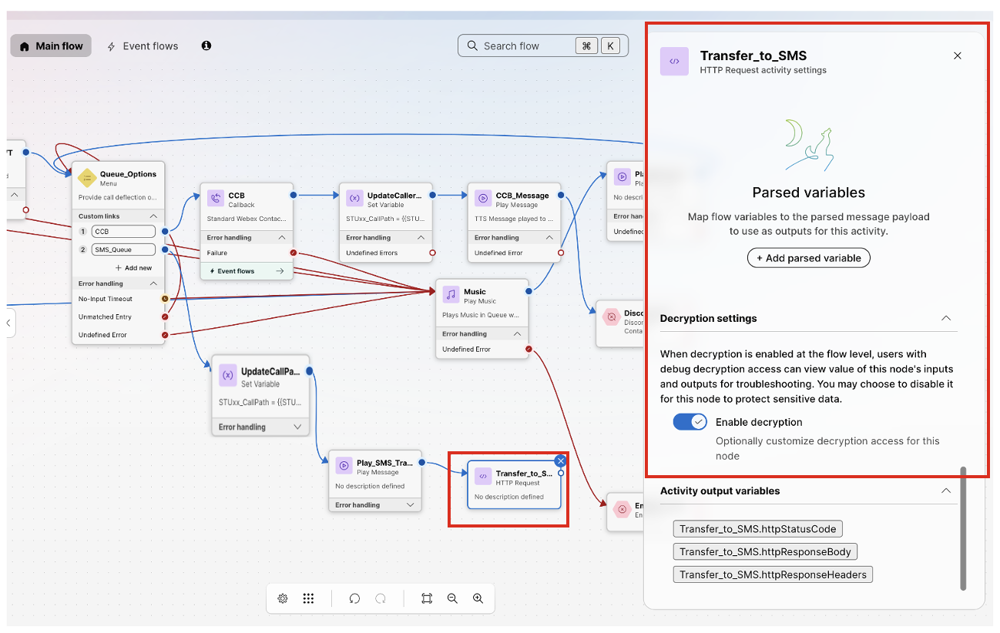

* Connect the Transfer\_to\_SMS node exit path to a DisconnectContact node
* Click on Validation
* Click on Publish Flow Save as Latest

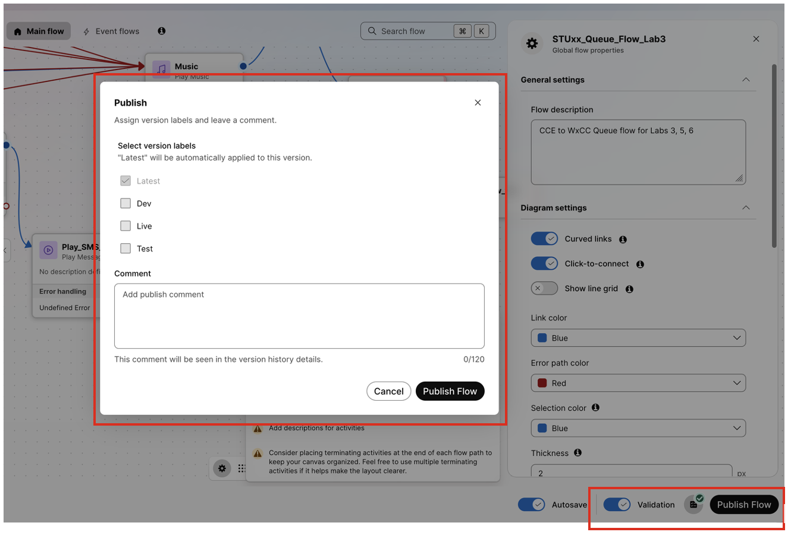

* Login your Test agent and test
  + Stay not ready until option 2, SMS queue selected.

## Finish Lab 7
